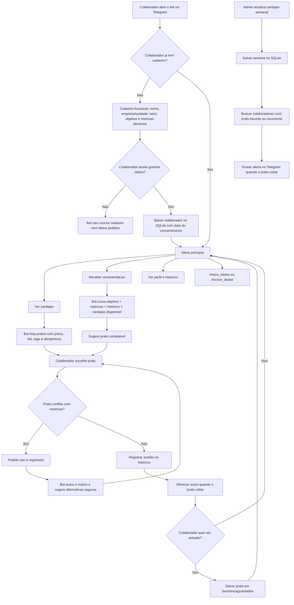

# ApetitFoodBot

MVP de bot Telegram da Apetit destinado aos funcionarios/colaboradores das empresas e unidades atendidas, nao a clientes finais. O sistema oferece:

- boas-vindas com `/start`
- cadastro obrigatorio antes de pedidos
- aceite LGPD antes de salvar dados pessoais
- cadastro funcional com empresa/unidade e setor
- objetivo do colaborador no cadastro: perder peso, ganhar massa, manter equilibrio, alimentacao saudavel ou praticidade
- banco SQLite com colaboradores e historico de pedidos
- comandos `/meus_dados` e `/excluir_dados`
- cardapio real no banco com preco, dia, ingredientes, alergenicos e tags
- cardapio do dia
- cardapio sem carne
- recomendacao inteligente baseada no cadastro e historico do colaborador
- perfil nutricional opcional com meta estimada de calorias, proteina e porcao
- semaforo de aderencia ao objetivo em cada prato do cardapio
- gamificacao com pontos, streak, badges e ranking pseudonimizado
- bloqueio de pedido incompatavel com restricao alimentar cadastrada
- reclamacao com escuta empatica
- feedback positivo
- alerta de restricao alimentar
- perfil nutricional demonstrativo

## Seguranca do token

Se um token foi colado em chat, issue, commit ou qualquer lugar publico, gere outro no BotFather.
Nao salve o token diretamente no codigo.

## Rodar localmente

```powershell
python -m venv .venv
.\.venv\Scripts\Activate.ps1
pip install -r requirements.txt
Copy-Item .env.example .env
```

Edite o arquivo `.env` e coloque o token novo:

```env
TELEGRAM_BOT_TOKEN=seu_token_novo
APETIT_USER_NAME=Mariana
APETIT_DB_PATH=apetit.db
```

Depois inicie:

```powershell
python bot.py
```

Para rodar os testes:

```powershell
python -m unittest discover -s tests
```

No Telegram, abra o bot e envie:

```text
/start
```

O bot vai pedir nome, empresa/unidade, setor, objetivo alimentar, restricao alimentar e aceite LGPD antes de liberar cardapio, recomendacoes ou pedidos.
Quando o colaborador escolhe um prato, o bot confere os alergenicos, ingredientes e tags antes de registrar o pedido. Se houver conflito com a restricao cadastrada, o pedido nao e gravado e o bot sugere alternativas mais seguras.
As recomendacoes consideram o objetivo do colaborador e o historico de pedidos.

Para refazer o cadastro, envie:

```text
/recadastrar
```

Para ver o historico de pedidos:

```text
/historico
```

Para ver o cardapio disponivel:

```text
/cardapio
```

Para consultar ou excluir os dados do colaborador:

```text
/meus_dados
/excluir_dados
```

Para criar a meta nutricional e acompanhar a gamificacao:

```text
/minha_meta
/meu_progresso
/ranking
```

## Banco de dados

O bot cria automaticamente o arquivo `apetit.db` com:

- colaboradores cadastrados, empresa/unidade e setor
- aceite LGPD e data do consentimento
- historico de pedidos
- pratos cadastrados no cardapio
- pratos favoritos/aguardados
- atualizacoes de cardapio semanal
- perfil nutricional e consentimento especifico
- eventos de pontuacao, streak e badges

Esse arquivo fica fora do Git por seguranca e privacidade.

## LGPD e consentimento

Como o bot guarda empresa/unidade, setor, historico e preferencias, o cadastro so e concluido depois do aceite do colaborador.

O colaborador pode:

- ver os dados salvos com `/meus_dados`
- excluir cadastro, historico e favoritos com `/excluir_dados`
- refazer o cadastro com `/recadastrar`

O banco guarda `consent_accepted` e `consented_at`. Se o colaborador nao aceitar, o bot nao conclui o cadastro nem libera pedidos.

O perfil nutricional pede um segundo consentimento antes de guardar peso, altura, idade, sexo usado pela formula e nivel de atividade. O ranking nao mostra nomes: outros participantes aparecem com um identificador pseudonimizado.

## Nutricao e gamificacao

O comando `/minha_meta` coleta peso, altura, idade, sexo usado pela equacao, atividade e objetivo. O bot calcula:

- gasto em repouso pela equacao de Mifflin-St Jeor
- manutencao estimada usando um fator de atividade
- meta calorica educativa conforme o objetivo
- proteina diaria estimada e orientacao de porcao do almoco

Para a meta calorica, o MVP aplica `-15%` para perder peso, manutencao para equilibrio/saude/praticidade e `+10%` para ganhar massa. Para proteina, aplica de `1,4` a `1,8 g/kg/dia` conforme o objetivo.

A equacao foi publicada para adultos saudaveis de 19 a 78 anos e e uma estimativa, nao uma prescricao. As metas de proteina usam valores conservadores dentro da literatura para pessoas fisicamente ativas. Referencias: [Mifflin et al. no PubMed](https://pubmed.ncbi.nlm.nih.gov/2305711/) e [position stand da ISSN sobre proteina](https://pmc.ncbi.nlm.nih.gov/articles/PMC5477153/).

Gestantes, menores de 19 anos, maiores de 78 anos, pessoas com doencas, restricoes clinicas ou necessidades especificas devem buscar nutricionista ou medico. O bot nao diagnostica, nao substitui acompanhamento profissional e nao estima os nutrientes de um prato sem ficha tecnica.

O semaforo representa aderencia ao objetivo e compatibilidade com a restricao cadastrada:

- verde: boa aderencia a meta
- amarelo: opcao compativel, com atencao a porcao
- vermelho: conflito com a restricao alimentar

Pontuacao:

- `+5` por acessar a dica/meta, no maximo uma vez ao dia
- `+20` por pedir o prato recomendado
- `+10` por registrar que seguiu parcialmente
- `+10` por prato identificado como salada
- `+15` por prato identificado como fruta

Eventos repetidos para o mesmo prato no mesmo dia nao acumulam. Seguir integral e parcialmente a mesma recomendacao sao eventos mutuamente exclusivos.

Badges:

- `Primeiro Passo`: primeiros pontos
- `Em Chamas`: streak de 3 dias
- `Guardiao Verde`: 3 eventos de salada
- `Vida Saudavel`: 100 pontos
- `Mestre Apetit`: 500 pontos e streak de 7 dias

## Grafo do fluxo



## Cadastrar pratos

Administradores podem cadastrar ou atualizar pratos assim:

```text
/cardapio_add Nome do prato | 29,90 | segunda | ingredientes | alergenicos | tags | disponivel
```

Exemplo:

```text
/cardapio_add Frango Grelhado | 31,90 | quinta | frango, arroz, legumes | nenhum | proteico, caseiro | sim
```

Para listar o cardapio cadastrado:

```text
/cardapio_list
```

Para ver um resumo administrativo com colaboradores por empresa/unidade, pedidos, favoritos e pratos mais pedidos:

```text
/relatorio
```

## Atualizar cardapio semanal

Envie o comando abaixo no Telegram para registrar os pratos da semana e avisar colaboradores que aguardam algum deles ou ja pediram o prato varias vezes:

```text
/cardapio_semana Lasanha de Legumes
Peixe Assado com Legumes
Sopa de Lentilha
```

Para habilitar os comandos administrativos, configure no `.env` os IDs autorizados:

```env
ADMIN_TELEGRAM_IDS=123456789,987654321
APETIT_DB_PATH=apetit.db
```

Sem `ADMIN_TELEGRAM_IDS`, os comandos administrativos permanecem bloqueados.

## Deploy

Para operar de verdade, use webhook em producao e deixe polling apenas para testes locais.

Variaveis recomendadas:

```env
TELEGRAM_BOT_TOKEN=seu_token_novo
ADMIN_TELEGRAM_IDS=123456789
APETIT_DB_PATH=apetit.db
TELEGRAM_WEBHOOK_URL=https://seu-app.onrender.com
TELEGRAM_WEBHOOK_PATH=telegram-webhook
TELEGRAM_WEBHOOK_SECRET_TOKEN=um-segredo-forte
PORT=8000
```

Com `TELEGRAM_WEBHOOK_URL` preenchido, o bot sobe com webhook automaticamente. Sem essa variavel, ele continua usando polling.

Opcoes de hospedagem:

- Render, Railway ou Fly para uma primeira versao gerenciada
- VPS quando voce quiser mais controle de sistema, disco e backups
- SQLite funciona para MVP; para escala maior, considere migrar para PostgreSQL

Backup do banco:

```powershell
python scripts/backup_db.py
```

O script cria uma copia em `backups/`. Em producao, agende esse comando no provedor ou na VPS e guarde copias fora da maquina principal.

Logs e monitoramento:

- os logs saem no stdout do processo, que Render/Railway/Fly/VPS conseguem capturar
- monitore reinicios, erros de webhook e espaco em disco
- mantenha um alerta simples para queda do servico e falhas de backup

## Checklist antes de usar com colaboradores

- gerar um token novo no BotFather se o token antigo foi exposto
- preencher `TELEGRAM_BOT_TOKEN` no `.env`
- configurar `ADMIN_TELEGRAM_IDS` para proteger comandos administrativos
- preencher `TELEGRAM_WEBHOOK_URL` em producao
- configurar rotina de backup do banco
- cadastrar pratos reais com ingredientes, alergenicos e tags
- testar um cadastro novo com `/start`
- testar aceite LGPD, `/meus_dados` e `/excluir_dados`
- testar objetivos diferentes, como perder peso e ganhar massa
- testar o consentimento nutricional e o fluxo completo de `/minha_meta`
- testar `/meu_progresso`, pontuacao sem duplicidade e `/ranking`
- testar uma restricao alimentar e confirmar que prato incompatavel e bloqueado
- testar `/cardapio_semana` com um prato favorito para confirmar o alerta

## Exemplos de frases

- `O que tem hoje sem carne?`
- `O que voce recomenda hoje?`
- `A comida estava fria.`
- `Gostei muito do almoco de hoje!`
- `Posso pedir o estrogonofe de cogumelos?`
