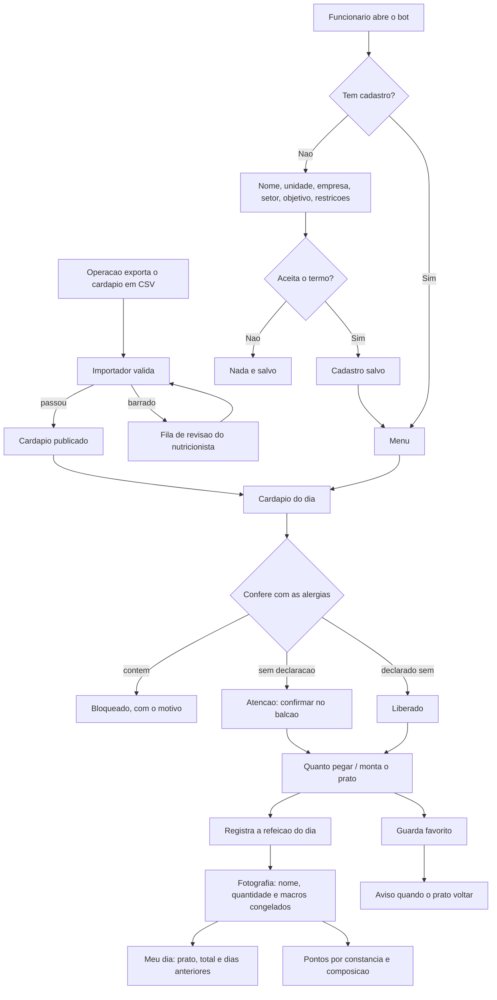

# ApetitFoodBot

Bot de controle nutricional para funcionarios atendidos pela Apetit.

A empresa serve o refeitorio; o funcionario acompanha o que come. **Nao ha venda,
preco, carrinho nem pedido.** O cardapio da operacao e importado, validado e
publicado, e o funcionario monta o prato e registra o consumo.

## O que o funcionario faz

- cadastra unidade da Apetit, empresa, setor, objetivo e restricoes alimentares
- ve o cardapio do dia **ja conferido contra as proprias alergias**
- monta o prato e ve kcal e macros somarem contra o alvo do objetivo
- registra o almoco e acumula pontos
- guarda pratos favoritos e e avisado quando voltam ao cardapio
- **avalia o refeitorio** — comida, atendimento e o que faltou — sem se
  identificar para a empresa
- consulta e apaga os proprios dados quando quiser

## Comandos

| Comando | O que faz |
|---|---|
| `/start` | Cadastro ou menu principal |
| `/quanto_pegar` | Quantas conchas e colheres pegar para bater a meta |
| `/montar` | Monta o prato passo a passo, na ordem da fila |
| `/cardapio` | Cardapio de hoje com alerta de alergenico |
| `/avaliar` | Avalia o refeitorio de hoje (comida, atendimento, falta) |
| `/meu_dia` | O que comeu hoje e nos dias anteriores |
| `/favoritos` | Pratos guardados |
| `/progresso` | Sequencia e conquistas da pessoa |
| `/ficha` | Ficha do nutricionista da propria pessoa |
| `/avisos` | Liga e desliga o resumo semanal e o lembrete do almoco |
| `/ajuda` | Como usar |
| `/meus_dados` `/excluir_dados` | LGPD |
| `/recadastrar` | Refaz o cadastro |

Os comandos sao publicados no menu do Telegram (`setMyCommands`), entao aparecem
sozinhos na interface.

Administracao e nutricionista:

| Comando | O que faz |
|---|---|
| **anexar .csv/.xlsx** | **Publica o cardapio da semana** — e so mandar o arquivo |
| `/importar` | Explica como publicar o cardapio |
| `/pendencias` | Fila de revisao da importacao |
| `/alergenico <prato> <alergenico> <estado>` | Declara alergenico de um prato |
| `/relatorio` | Adesao **agregada** por setor |
| `/piloto [convidados] [desde] [ate]` | Relatorio do piloto, **sem individualizar ninguem** |
| `/atendimento [refeitorio]` | Como cada refeitorio esta sendo avaliado, **sempre agregado** |
| `/avisar_favoritos` | Dispara aviso de prato favorito voltando |

## Rodar localmente

```powershell
python -m venv .venv
.\.venv\Scripts\Activate.ps1
pip install -r requirements.txt
Copy-Item .env.example .env
python bot.py
```

Testes:

```powershell
python -m unittest discover -s tests
```

## Decisoes de interface

O app e de acompanhamento **pessoal**. Quem usa quer comer melhor, nao ler
macronutriente. Tres decisoes seguem disso:

**Montar o prato segue a ordem da fila do refeitorio** — prato principal,
guarnicao, arroz, feijao, salada, sobremesa — uma categoria por vez, com "Passo
3 de 6". O app acompanha a bandeja em vez de mostrar uma lista unica com tudo.

**Numero vem com leitura em palavras.** "Prato leve para o seu objetivo",
"Faltam 12 g de proteina", "Sem salada nem fruta — vale somar uma". O numero fica,
mas em segundo plano. A leitura descreve onde o prato esta; nunca manda comer
menos, porque quem prescreve e o nutricionista.

**O cadastro oferece, nao pergunta codigo.** Refeitorio, empresa e setor viram
botoes com o que ja existe no banco, com saida para digitar quando for novo. O
funcionario nao sabe que a unidade dele se chama `SM` no sistema da operacao.

## Quanto pegar, em concha e colher

O funcionario nao serve gramas: ele serve concha, colher e pegador. Entao a
sugestao sai na medida do refeitorio.

```
Quanto pegar hoje
segunda-feira, 1 de setembro · objetivo: Manter o equilibrio

• 1 porcao de File de frango grelhado
• 2 colheres de Macarrao alho e oleo
• 2 colheres de Arroz parboilizado
• 1 concha de Feijao preto
• Mix de alface a vontade

Isso da 711 kcal e 44 g de proteina. E a sua meta do dia.
```

O que torna a conta simples: no cardapio da operacao **cada linha ja e uma porcao
padrao**. ARROZ PARBOILIZADO com 138 kcal e uma colher de servir; FEIJAO PRETO
com 29 kcal e uma concha. Entao a sugestao multiplica, nao converte.

Cinco regras seguram o resultado:

- **prato bloqueado nao entra** — sugerir quantidade de algo que a pessoa nao
  pode comer seria pior que nao sugerir nada
- **teto por categoria** — no maximo 3 colheres de arroz, 2 conchas de feijao;
  sem isso a conta viraria recomendacao absurda
- **o prato principal so se repete enquanto falta proteina** — depois da meta
  fechada ele e apenas a opcao mais calorica da bandeja, e repetir viraria
  "pegue duas porcoes de carne" so para fechar energia. Energia que falta se
  fecha com arroz e guarnicao
- **sobremesa e bebida ficam de fora** — nao e papel do app empurrar pudim para
  fechar caloria
- **quando o cardapio nao alcanca o alvo, ele diz** em vez de inventar porcao

O fecho cobra proteina e energia separadamente: bater a proteina e ficar 200
kcal abaixo do alvo nao e "a meta do dia", e anunciar assim faria o app declarar
cumprido o que nao cumpriu.

Salada entra como "a vontade": quase nao move o total e faz bem.

E sugestao, nao prescricao. Quem define quantidade individual e o nutricionista
responsavel.

## Historico do funcionario

Da tela de sugestao sai um botao so: **Vou pegar isso**. Um toque grava a refeicao
do dia com as quantidades sugeridas. Quem prefere ajustar usa **Montar meu prato**
e marca item por item. Nos dois casos, registrar de novo no mesmo dia substitui o
registro anterior — nao empilha.

O `/meu_dia` devolve o prato do jeito que foi pego, com o total do dia e os dias
anteriores:

```
Meu dia

Prato equilibrado para o seu objetivo.
Tem salada no prato.

• Carne assada ao molho — 2 porcoes
• Arroz parboilizado — 2 colheres
• Feijao preto — 1 concha
• Mix de alface — 1 pegador

703 kcal · 33 g de proteina

Seu historico
sexta-feira, 29 de agosto — 612 kcal · 28 g ptn
• ...
```

### O historico e fotografia, nao ponteiro

A tabela `consumption` guarda **nome, categoria, quantidade e macros congelados no
momento do registro**, e nao uma referencia viva para a ficha tecnica.

O motivo e concreto: a operacao reimporta cardapio e corrige ficha tecnica o tempo
todo. Se o historico apontasse para `menu_item`, corrigir o macro de um prato em
novembro mudaria retroativamente o que a pessoa comeu em setembro. Histórico que
muda sozinho nao serve para acompanhar nada.

Consequencias praticas:

- corrigir a ficha tecnica afeta o **proximo** registro, nunca os anteriores
- item que sai do cardapio nao apaga o registro de quem comeu; o que fica nulo e o
  macro, e o total do dia se declara incompleto em vez de fingir zero
- quantidade e coluna: "2 conchas" e uma linha com `quantity = 2`, entao o total do
  dia multiplica em vez de contar item repetido

Bancos criados antes dessa mudanca sao migrados no `init_schema`: as colunas novas
sao criadas e preenchidas com o que a ficha tecnica diz no momento da migracao — a
melhor aproximacao disponivel para um registro feito antes de existir fotografia.
A partir dali o valor para de mudar sozinho.

## Publicar o cardapio da semana

**Mande o arquivo para o bot.** Toda semana, quem tem o cardapio anexa o `.csv`
ou `.xlsx` na conversa do Telegram, do jeito que a operacao exporta. Sem
terminal, sem repositorio, sem Python, sem lembrar flag nenhuma.

```
📄 Cardapio_17_a_2108.xlsx

Refeitorio: Refeitorio Central
Periodo: segunda-feira, 17 de agosto
         ate sexta-feira, 21 de agosto
mes e ano vieram de o nome do arquivo (17_a_2108)

80 itens em 5 dia(s) · 58 pratos diferentes
⚠️ 80 sem informacao nutricional

Confira o periodo antes de publicar.

[ ✅ Publicar este cardapio ]
[ 📅 Trocar o mes ]  [ 🏢 Trocar o refeitorio ]  [ ❌ Cancelar ]
```

A planilha traz so o numero do dia, sem mes nem ano. Pelo terminal isso virava
`--mes 8 --ano 2025` digitado a mao toda semana — campo que alguem erra em
novembro e publica a semana no dia errado. Agora o mes sai do nome do arquivo
(`Cardapio_17_a_2108` diz 21/08) e a pessoa so **confirma**.

O palpite nunca publica sozinho. A tela mostra as **datas ja montadas**, nao
"mes 8": data por extenso e o que alguem consegue conferir de relance. Sem
confirmacao, nada vai para o ar.

Tres protecoes que sobreviveram a mudanca:

- **Sem refeitorio nao publica.** O funcionario ve o cardapio filtrado pela
  unidade dele; publicar sem unidade e publicar para ninguem, e some sem erro
  nenhum — a pior forma de falhar.
- **Fim de semana vira aviso.** Se as datas montadas caem no sabado ou domingo,
  o mes ou o ano do palpite quase certamente esta errado: os dias vem da
  planilha, entao o que nao bate e o mes/ano. O proprio calendario denuncia o
  palpite, sem precisar de outro palpite. Fica como aviso, porque existe
  refeitorio que serve no fim de semana.
- **Reenviar o mesmo periodo substitui.** E como a operacao corrige uma semana
  ja publicada: manda o arquivo corrigido de novo.

`/importar` explica isso dentro do bot. O caminho por terminal continua valendo
para carga em lote:

## Importacao pelo terminal

O importador aceita os tres layouts observados, com separador `;` ou `,` e
decimal com virgula:

| Layout | Como e | Traz macro? |
|---|---|---|
| **largo** | uma linha por dia, cinco colunas por categoria (NOME, KCAL, CHO, LIP, PTN) | sim |
| **longo** | uma linha por item, colunas nomeadas | sim |
| **planejamento** | uma linha por dia, uma coluna por categoria, tudo grudado na celula | **nao** |

```powershell
python scripts/import_cardapio.py cardapio.csv --unidade SM --refeicao almoco
python scripts/import_cardapio.py Cardapio_17_a_2108.xlsx --unidade SM --mes 8 --ano 2025
python scripts/import_cardapio.py --pendencias
```

Categoria com numero, como `PRATO PRINCIPAL 2`, e a mesma categoria em outro slot.

### A planilha de planejamento

E o formato que a operacao manda toda semana. Cada celula junta quatro coisas:

```
BIFE ACEBOLADO (80g) - C51 - 3.11
└─ nome         └ porcao └ ficha └ custo per capita
```

O importador separa os quatro. **O custo morre na leitura** — e dado comercial
da Apetit e nao existe caminho por onde ele chegue ao app do funcionario; ha
teste garantindo isso. A porcao entre parenteses vira `portion_g`, e o codigo
da ficha entra no identificador do item, que e o gancho para casar esta
planilha com a que tiver os macros.

Tres detalhes que o formato exige:

- **O nome pode conter o proprio separador** (`KIT - QUIMICO - A. YOSHII`).
  Por isso o que sobra depois de tirar as pontas conhecidas e remontado
  inteiro, em vez de o parser chutar qual pedaco e o nome.
- **Colunas de insumo sao descartadas** — descartaveis, produto de limpeza,
  kit de tempero e de galeteiro nao sao comida que alguem se serve.
- **A coluna do dia traz so o numero** (`17`), sem mes nem ano. Sem `--mes` e
  `--ano` a importacao **para**, em vez de chutar: um mes errado publicaria o
  cardapio da semana no dia errado.

Importar planejamento por cima de uma ficha tecnica ja carregada **nao apaga os
macros** — todo campo nutricional entra por `COALESCE`, entao valor novo
nao-nulo vence e ausencia preserva o que estava la.

### Ausencia de macro nunca vira zero

A mesma invariante que vale para alergenico vale para valor nutricional: o que
o app nao sabe, ele nao afirma.

Somar item sem macro como zero produzia isto, para quem pegou carne, arroz,
feijao e salada de um cardapio sem ficha tecnica:

```
Prato leve para o seu objetivo de hoje.
Faltam 30 g de proteina para o seu alvo.
0 kcal · 0 g proteina
```

Nada ali era verdade. Hoje a leitura do prato recebe quantos itens sao
legiveis, e:

- **nenhum legivel** — o app nao classifica o prato: "ainda nao consigo ler
  este prato"
- **parte legivel** — o total vira piso explicito ("no minimo 280 kcal") e o
  prato tambem nao e classificado, porque classificar soma incompleta e
  afirmar o que nao se sabe
- **tudo legivel** — leitura normal

Item so conta como legivel tendo **kcal e proteina**: e o par que o app usa para
dizer qualquer coisa, e so kcal deixava a proteina entrar como zero silencioso.
A composicao do prato ("sem salada nem fruta") continua sendo lida sem macro
nenhum, porque para isso a categoria basta.

### O que essa planilha sozinha nao resolve

Ela nao tem valor nutricional nenhum. Com so ela no banco, a semana de 17 a 21
importa 80 itens em 5 dias e o funcionario ve o cardapio inteiro, organizado na
ordem da fila — mas:

- **`/quanto_pegar` nao responde.** Sem kcal e proteina nao ha o que sugerir, e
  o app diz isso em vez de inventar porcao.
- **`/meu_dia` registra o prato, com total zerado.** A fotografia guarda o que
  foi pego; os macros ficam nulos e o dia se declara incompleto.
- **Todo prato aparece como ⚠️** para quem tem alergia declarada, porque sem
  ficha tecnica nao da para afirmar que e seguro.

Falta a ficha tecnica com os macros. Como o codigo dela (`C51`,
`06.03.01.258`) ja vem nesta planilha, os dois arquivos casam pelo codigo assim
que o segundo existir.

Colunas de **custo e per capita sao descartadas**: sao dado comercial da operacao
e nao podem chegar ao app do funcionario.

### Validacao antes de publicar

| Regra | Acao |
|---|---|
| Energia declarada x Atwater (4/9/4) divergindo mais de 25% **e** de 30 kcal | bloqueia |
| Macros somando mais que a porcao | bloqueia |
| Valor negativo | bloqueia |
| Macro incompleto | publica marcado como sem informacao |

O limite duplo na primeira regra e o que faz ela funcionar: so o relativo barraria
salada de 4 kcal por 2 kcal de arredondamento.

Item bloqueado **nao chega ao cardapio** — vai para a fila de revisao com o motivo,
agrupada por ficha tecnica, ja que a mesma ficha errada reaparece em varios dias
do mes e a correcao e uma so.

## Alergenicos

A lista segue os alergenicos de declaracao obrigatoria da RDC 26/2015 da ANVISA.
A conferencia tem **tres estados, nao dois**:

| Ficha tecnica diz | Resposta ao funcionario |
|---|---|
| Contem | Bloqueio, com o alergenico nomeado |
| Pode conter / tracos | Atencao — confirmar no balcao |
| **Nada** | Atencao — o app nao afirma que e seguro |
| Todos os alergenicos da pessoa como nao contem | Liberado |

**Falta de informacao nunca vira liberacao.** Deduzir alergenico do nome do prato
e o erro que machuca: "STROGONOFF DE CARNE" nao avisa que leva creme de leite,
"FILE DE FRANGO A MILANESA" nao avisa que leva ovo e trigo.

### O funcionario escreve, o app reconhece

No cadastro a pessoa escreve do jeito dela — "alergia a frutos do mar", "nao
posso leite nem ovo", "sou celiaco" — e o app traduz para os codigos da lista.
Antes de salvar, ele mostra o que entendeu para a pessoa confirmar.

| A pessoa escreve | O app entende |
|---|---|
| alergia a frutos do mar | Crustaceos + Peixes |
| intolerante a lactose | Leite e derivados |
| sou celiaco | Gluten |
| nao posso leite nem ovo | Leite + Ovos |

Duas regras seguram a honestidade:

**Nada e adivinhado por semelhanca.** So casa com sinonimo conhecido. Errar para
o lado do "reconheci" e pior que pedir para a pessoa confirmar.

**O que nao for reconhecido nao e descartado.** "Alergia a legumes" nao existe
como campo em ficha tecnica nenhuma. O termo fica guardado, aparece no cadastro
marcado como *nao conferido pelo app*, e — o ponto importante — **enquanto a
pessoa tiver um termo desses, nenhum prato aparece como liberado.** Mostrar visto
verde a quem tem restricao que o app nao checa e pior que nao mostrar nada.

Quem preferir marcar numa lista em vez de escrever tem essa saida no proprio passo.

### O nome do prato tambem conta

O cardapio ja diz em voz alta o que o prato e: "FEIJAO PRETO" tem feijao,
"SALADA DE CAMARAO" tem camarao. Entao quem escreve "nao posso feijao" tem o
prato bloqueado sem precisar de ficha tecnica nenhuma.

Isso vale **numa direcao so**: o nome prova presenca, nunca ausencia.
"Strogonoff de carne" nao ter "leite" no nome nao prova que nao leva creme de
leite. Por isso o casamento por nome bloqueia, mas nunca libera.

Casa variacao de palavra — "feijao" pega "feijoada", "carne" pega "carnes" — e
na duvida casa: um bloqueio a mais a pessoa percebe e contorna; um bloqueio a
menos ela come.

### Alergia ou so prefiro evitar

Quando o termo nao e um alergenico conhecido, o app pergunta o quanto ser
rigoroso, porque as duas coisas pedem tratamento diferente:

| A pessoa responde | O que o app faz |
|---|---|
| **E alergia** | Bloqueia pelo nome **e** avisa em todo prato que nao consegue confirmar |
| **So prefiro evitar** | Bloqueia so quando aparece no nome; fica quieto no resto |

A diferenca e grande na pratica. Num cardapio real de 13 itens, "nao posso
feijao" como alergia gera **12 avisos**; como preferencia, gera **1 bloqueio e
nenhum aviso**. Tratar preferencia com rigor de alergia enche a tela de alerta
ate a pessoa parar de ler o que importa.

### Os dois lados do alerta

O aviso so funciona cruzando duas informacoes, que vem de fontes diferentes:

| Lado | Quem informa |
|---|---|
| **A que a pessoa e alergica** | O proprio funcionario, no cadastro |
| **O que cada prato contem** | So a cozinha sabe |

O funcionario declarar a alergia dele nao resolve o segundo lado: ele sabe que
nao pode leite, mas nao tem como saber se o strogonoff de hoje leva creme de
leite. Por isso, sem o dado do prato, a resposta e "nao consigo confirmar".

### Como declarar o que cada prato contem

**1. No proprio CSV do cardapio.** Colunas como `alerg_leite` ou `contem_gluten`
sao importadas automaticamente, aceitando `sim`/`nao`/`pode conter`/`tracos`.
Celula vazia continua como nao declarado.

**2. Planilha do nutricionista**, enquanto o export nao tiver o campo:

```powershell
python scripts/alergenicos.py --exportar alergenicos.csv
# nutricionista preenche no Excel: sim / nao / pode conter
python scripts/alergenicos.py --importar alergenicos.csv
python scripts/alergenicos.py --cobertura
```

O trabalho e finito e se paga: num mes real, **110 fichas cobriram 312
ocorrencias** do cardapio. A planilha sai ordenada pelos pratos que mais
aparecem, entao declarar arroz, feijao e refresco ja resolve boa parte do
cardapio.

**3. Prato a prato**, pelo `/alergenico` no Telegram.

**4. Pela planilha de receitas da operacao** — o caminho que cobre mais de uma vez:

```powershell
python scripts/receitas.py --importar Receitas-Cardapio-Nutri.xlsx --so-conferir
python scripts/receitas.py --importar Receitas-Cardapio-Nutri.xlsx
python scripts/receitas.py --revisar Receitas.xlsx --prato strogonoff_de_carne
```

A planilha de receitas traz **a lista de ingredientes de cada prato** — 4.952
receitas, 27.298 linhas de ingrediente. E dela que sai a declaracao que a ficha
tecnica nunca trouxe. O `apetit/allergens.py` abre dizendo qual era o problema:
"STROGONOFF DE CARNE nao avisa que leva creme de leite". A receita avisa — ela
lista `COMPOSTO LACTEO`.

Tres regras seguram a deducao (detalhe em `apetit/recipes.py`):

- **Ingrediente prova presenca, nunca ausencia.** O script **nunca grava
  `nao_contem`**: a receita pode omitir o molho pronto, o ingrediente composto
  pode esconder alergenico na formula e existe contaminacao cruzada na cozinha,
  que nenhuma lista enxerga. Liberar um prato continua sendo decisao da
  nutricionista.
- **Casamento por palavra inteira, com excecao explicita.** "COUVE MANTEIGA"
  nao tem manteiga, "PAO DE QUEIJO" e de polvilho e nao tem gluten, "PAO SIRIO"
  nao tem siri, "LEITE DE COCO" nao e leite e "NOZ MOSCADA" nao e noz. Cada uma
  dessas e um ⚠️ falso que nao aparece — e ⚠️ falso ensina a pessoa a ignorar o
  ⚠️ verdadeiro.
- **Prato com variantes que discordam fica sem declaracao.** "CARNE ASSADA AO
  MOLHO" existe com champignon e ao molho madeira, com ingredientes diferentes.
  Onde as variantes concordam, a resposta e a mesma qualquer que seja a que foi
  para a panela e da para declarar; onde discordam, nao.

Oleo de soja aparece em 1.811 das 27.298 linhas. A RDC 26/2015 dispensa os
oleos vegetais totalmente refinados, e marcar "contem soja" em todo prato
apagaria o aviso para quem tem alergia de verdade. O app marca `pode_conter` e
deixa visivel; `OLEO_VEGETAL_REFINADO`, no topo de `apetit/recipes.py`, e a
linha unica para a nutricionista mudar se o caso for outro.

O resultado entra com `source = "lista de ingredientes"`: e deducao para a
nutricionista revisar, nao declaracao da cozinha.

Acompanhe com `/cobertura` ou `--cobertura`.

## Progresso

E acompanhamento pessoal: **nao existe ranking e ninguem compara o funcionario
com colega nenhum.** O que aparece e a propria sequencia ("voce registrou 3 de 5
dias desta semana") e as proprias conquistas.

Pontuam **constancia** (registrar), **composicao** (incluir salada ou fruta),
**variedade** na semana e **meta de proteina**.

Nenhuma regra premia deficit calorico ou perda de peso, e **nao ha ranking entre
colegas**. Num app corporativo, premiar comer menos sob o olhar do empregador
empurra para uma relacao ruim com comida. Cada regra carrega o campo `basis` e ha
teste garantindo que nenhuma se apoie em deficit ou peso.

Os alvos de kcal e proteina por objetivo sao **ilustrativos**. Quem define faixa
individual e o nutricionista responsavel: o app informa e acompanha, nao prescreve.

## A ficha do nutricionista (`/ficha`)

Quem faz acompanhamento tem numero de verdade, nao o alvo ilustrativo de um
objetivo generico. O funcionario manda a ficha em PDF (ou digita os numeros, que
e o caso comum: ficha de papel), confere o que o app entendeu e confirma — so
entao o app passa a seguir **a ficha dela** no lugar do objetivo do cadastro.

Isso nao faz o app prescrever nada (Lei 8.234/1991). Ao contrario: quem
prescreveu foi o nutricionista, e o app virou a ferramenta de **seguir** a
prescricao no cardapio do dia.

Tres regras seguram o resto:

**1. Nada vale sem a pessoa confirmar.** A tela mostra cada numero com o trecho
da ficha de onde ele saiu — `li de: "VET: 1800 kcal/dia"`. Sem o trecho, a pessoa
confirmaria as cegas uma leitura automatica de documento clinico. Numero lido
errado sai com um toque.

**2. Total do dia nunca vira alvo de refeicao.** E o erro que machuca: uma ficha
de 1.800 kcal/dia aplicada ao almoco mandaria a pessoa comer o dia inteiro num
prato so. O app **sempre** pergunta se os numeros sao do dia ou do almoco, mesmo
quando a ficha parece dizer, e reparte usando a proporcao usual do almoco (35%)
deixando claro que repartir o dia e decisao do nutricionista. Se ainda assim
sobrar um alvo implausivel para uma refeicao (acima de 1.500 kcal ou 150 g de
proteina), o app **nao usa** esse numero e avisa.

**3. O documento nao fica guardado.** Ficha de nutricionista costuma trazer peso,
diagnostico e historico — dado de saude bem mais sensivel que "objetivo:
emagrecer". O app extrai os numeros, a pessoa confirma, e o documento e
descartado. Ha teste que vasculha o banco inteiro atras do conteudo da ficha.

O que a ficha manda evitar entra pelo mesmo caminho do "prefiro evitar": bloqueia
quando o termo aparece no nome do prato, sem virar alerta de alergenico — e
orientacao profissional, nao risco de reacao alergica.

Quando a ficha traz so metade do alvo (calorias mas nao proteina), a outra metade
continua vindo do objetivo, e a tela **diz qual e qual**. Sem proteina nao ha como
pontuar o dia, e apresentar palpite do app como numero do profissional seria pior
que o palpite.

PDF escaneado ou foto volta vazio de proposito: **nao ha OCR**. Reconhecer letra de
imagem erra, e errar aqui vira orientacao errada a partir do documento clinico de
alguem. O app admite que nao leu e oferece digitar os numeros.

## Avisos de progresso (`/avisos`)

Ate aqui o app so respondia. Uma mensagem que ele manda sozinho e outra coisa:
ela chega no celular da pessoa, num app da empresa, sobre o que ela come. Isso
pode ser util ou pode ser pressao, e a diferenca esta em poucas regras.

**Fala do proprio progresso, nunca do prato.** "Voce registrou 4 de 5 dias" e
sobre constancia. "Voce passou das calorias" seria o empregador comentando o
almoco de alguem, e nao existe aqui — ha teste varrendo o texto atras de
`caloria`, `peso` e `emagrec`.

**Nunca compara com colega.** Vale a mesma regra do resto do app: sem ranking,
sem media do setor.

**Quem nao esta usando para de receber.** Duas semanas sem nenhum registro e o
resumo cala. Sem isso o aviso vira cobranca semanal de um app corporativo para
quem ja decidiu nao usar — o jeito mais rapido de a pessoa passar a ignorar
tudo, inclusive o alerta de alergenico. A primeira semana em branco convida
("sem pressa"); a segunda nao chega.

**Bloquear o bot desliga o aviso**, em vez de render uma tentativa por semana
para sempre.

Dois avisos:

| Aviso | Quando | Padrao |
|---|---|---|
| Resumo da semana | sexta, 16h (Brasilia) | ligado |
| Lembrete do almoco | dia util, 11h, so se ainda nao registrou e ha cardapio | **desligado** |

O resumo ja vem ligado porque e o proprio progresso da pessoa, uma vez por
semana, desligavel em dois toques. O lembrete nao: ele chega todo dia util, e
ninguem pediu para um app da empresa lembrar da hora do almoco. Toda mensagem
termina com como parar de recebe-la.

O horario e fixo no fuso de Brasilia (UTC-3, sem horario de verao desde 2019),
nao em UTC: um lembrete de almoco precisa cair na hora do almoco de quem recebe.

Nada e enviado duas vezes — o envio fica marcado por periodo, entao reiniciar o
bot no meio do dia nao reenvia. E a marca so e gravada **depois** que o Telegram
aceitou: marcar antes faria uma queda de rede virar um resumo que a pessoa nunca
recebe e que nunca seria reenviado.

Os envios rodam na `JobQueue` do python-telegram-bot (extra `job-queue`). Se ela
faltar, o bot sobe do mesmo jeito e avisa no log: cardapio e alergenico nao caem
por causa do resumo semanal.

## Avaliacao do refeitorio

Depois de registrar a refeicao, o app pergunta como foi. Sao tres toques —
quem avalia esta na fila, de bandeja na mao:

```
A comida estava boa?     😋 Boa  · 😐 Regular · 😞 Ruim
E o atendimento?         😋 Bom  · 😐 Regular · 😞 Ruim
Faltou alguma coisa?     👍 Nao  · 👎 Sim → o que faltou
```

Comentario escrito e opcional. O convite so aparece se a pessoa ainda nao
avaliou naquele dia: pedir de novo o que ela ja respondeu e o caminho mais
rapido para ela parar de responder.

A escala e de tres niveis de proposito. Cinco estrelas viram indecisao na fila,
e o que a operacao precisa saber e se da para servir na segunda-feira, nao a
diferenca entre 3,4 e 3,6.

### A parte delicada: isto e o unico dado que a empresa le

Todo o resto do app e privado do funcionario — o que ele come, seu objetivo,
suas restricoes, a empresa nunca ve. Aqui o fluxo se inverte, e isso cria um
risco que precisa ser resolvido no desenho, nao na politica de uso:

> quem reclama do refeitorio esta reclamando do servico contratado pela propria
> empresa onde trabalha. Se a avaliacao chegasse identificada, o funcionario que
> disse "faltou comida" ficaria exposto a retaliacao — e o proximo aprenderia a
> mentir na avaliacao.

Quatro decisoes saem dai, todas com teste:

- **A linha de avaliacao nao tem coluna de empresa nem de setor.** Ela e sobre o
  refeitorio. Guardar o setor criaria exatamente o cruzamento que reidentifica
  ("a unica pessoa da manutencao que almocou terca"). Nao existe a coluna, entao
  nao ha como consultar por ali depois.
- **Nenhuma leitura para a gestao seleciona `telegram_id`.** Ele existe na tabela
  so para tres coisas: uma avaliacao por dia, a pessoa poder rever e trocar a
  propria, e a exclusao total quando ela pedir.
- **Abaixo de 5 avaliacoes no periodo, o recorte e suprimido** — media de tres
  pessoas nao e media, e opiniao identificavel.
- **Comentario escrito so sai com volume**, e em ordem alfabetica, nunca
  cronologica: a ordem de chegada cruzada com quem almocou no dia tambem aponta
  para uma pessoa.

A primeira tela diz isso ao funcionario antes da primeira pergunta. Quem nao
sabe que esta protegido responde como se nao estivesse.

Nao existe nota para funcionario do balcao por nome. Avaliacao individual de
trabalhador por trabalhador nao e problema de app, e viraria outra fonte de
retaliacao — do outro lado do balcao.

### O historico de atendimento

`/atendimento` lista os refeitorios do ultimo mes, **o pior primeiro**: o
relatorio existe para achar o refeitorio com problema, nao para exibir o que vai
bem.

```
Refeitorio Fabrica II: 24 avaliacoes · comida boa 62% · atendimento bom 46% · faltou algo em 42%
Refeitorio Administrativo: 24 avaliacoes · comida boa 92% · atendimento bom 92%
Refeitorio Central: 24 avaliacoes · comida boa 96% · atendimento bom 83%
```

`/atendimento <refeitorio>` abre o detalhe, com a serie semanal:

```
segunda-feira, 1 de setembro: 100% comida boa (12 avaliacoes)
segunda-feira, 8 de setembro:  25% comida boa (12 avaliacoes)

o que faltou: Acabou antes de eu chegar — 10x
```

A serie semanal existe porque a media do mes esconde a semana em que o
refeitorio caiu — nos numeros acima, a media do periodo diz 62% e some com a
queda de 100% para 25%.

O percentual ignora quem pulou aquela pergunta: quem nao deu nota de atendimento
nao conta como atendimento ruim.

## Privacidade

O app guarda dado de saude de funcionario dentro de uma relacao de emprego, o que
exige cuidado alem do aviso de consentimento:

- a empresa **nunca ve dado individual** — nem consumo, nem objetivo, nem restricao
- `/relatorio` mostra so adesao agregada por setor
- `/atendimento` mostra so media de refeitorio, suprimida abaixo de 5 avaliacoes,
  e a avaliacao nao guarda empresa nem setor de quem respondeu
- recorte com menos de **5 pessoas** e suprimido, porque setor pequeno mais dado
  alimentar reidentifica alguem sem precisar do nome
- `/excluir_dados` apaga cadastro, restricoes, consumo, favoritos, pontos e ficha
- a ficha do nutricionista entra como **numeros**: o documento nao e guardado

## Demonstracao instalavel no celular (`demo/`)

O bot vive no Telegram, e para o piloto as 15 pessoas precisam ver o app antes
de existir bot no ar. A pasta `demo/` e um **PWA**: abre no navegador do
celular, instala na tela inicial e roda em tela cheia, sem barra de navegador —
"como se ja estivesse instalado".

```powershell
python scripts/demo_telas.py demo/telas.json Receitas-Cardapio-Nutri.xlsx
python scripts/demo_icone.py demo/
cd demo; python -m http.server        # http://localhost:8000
```

As telas sao **geradas rodando o `bot.py` de verdade** (ver `scripts/demo_telas.py`),
entao o simulador nao envelhece sozinho: mudou o bot, roda o script de novo.

O `sw.js` existe por dois motivos. Sem service worker o navegador nao oferece
instalar na tela inicial. E o refeitorio costuma ter sinal ruim: um "app" que
abre em branco no subsolo da fabrica nao demonstra nada, entao o shell fica em
cache e abre sempre. Os dados das telas vao por rede primeiro, para uma
republicacao chegar sem reinstalar.

**Precisa de HTTPS.** Service worker e instalacao so funcionam em origem segura
— `localhost` no desenvolvimento, e um host com TLS para as 15 pessoas. Servido
de dentro de um iframe nao instala: a instalacao sai do documento de topo.

Os icones sao desenhados em codigo (`scripts/demo_icone.py`) em vez de virarem
binario solto: da para mudar a cor numa linha, e o `maskable` sai com margem
folgada porque o Android recorta o icone na forma do lancador.

### O cadastro, na primeira vez e depois

Quem abre o app pela primeira vez cai numa tela de boas-vindas e se cadastra do
zero: nome, refeitório, empresa e setor, objetivo, alergias e o termo — os
mesmos passos, na mesma ordem, com as mesmas palavras que o bot usa em
`ask_name` até `ask_consent`. Depois disso o cadastro fica guardado e a pessoa
edita quando quiser, no **Perfil → Editar meu cadastro**, ou apaga tudo ali
mesmo.

A tela de boas-vindas também oferece **"Só olhar, com o exemplo da Mariana"**.
O link do piloto é compartilhado, e quem só quer conferir o app precisa
conseguir, sem inventar um cadastro. O exemplo é dito com esse nome para
ninguém confundir dado de exemplo com dado seu.

**O cadastro muda o cardápio.** Os vereditos de alergênico não vêm prontos do
Python: eles são calculados no navegador, contra a lista de quem está usando o
app. Sem isso, quem se cadastrasse com outra alergia veria as cores da Mariana.
Isso põe a regra dos três estados em dois lugares — `apetit/allergens.py` e o
JavaScript de `demo/index.html` —, que é exatamente o jeito de os dois
discordarem um dia sem ninguém ver. A trava é `dados.conformidade`: o Python
calcula o veredito de cada prato para várias combinações de alergia, e

```bash
python scripts/conferir_vereditos.py
```

roda o app num navegador de verdade, se cadastra com cada combinação e falha se
um único prato divergir. A comparação é feita pelo que chega na tela
(`data-veredito` no botão do prato), e não pela função por dentro: o que importa
é o aviso que a pessoa viu.

Quem não declarou alergia **não** vê o cardápio inteiro de verde. `liberado`
afirma que alguém conferiu o prato para ela, e ninguém conferiu; o estado fica
`sem_restricao`, sem cor de segurança, e a tela diz por quê.

### Onde o cadastro fica guardado

Em `localStorage`, como a foto de perfil: esta demonstração não tem servidor, e
inventar um "salvo na nuvem" seria prometer o que não existe. No app de verdade
quem guarda é o banco do bot, com o mesmo `Employee`.

Num quadro embutido — e é assim que a prévia chega para quem só recebeu o link —
o navegador bloqueia o `localStorage` do endereço de dentro. Sem alternativa, o
cadastro morreria no último passo, e com uma mensagem sobre espaço em disco que
nem é o motivo. Então há dois lugares: o aparelho, quando dá, e a memória da
aba, quando não dá. O app funciona nos dois. O que muda é o que ele pode
prometer — e ele avisa **antes** dos seis passos, não depois.

### As cores, e por que o vermelho nao vai para todo lado

A interface usa o **vermelho `#EC003F`** e o **amarelo `#F5D94E`** já presentes
no app. O cabeçalho da home e os ícones usam vermelho; o amarelo destaca a ação
principal e o anel de pontos. O anel é decorativo: não representa porcentagem
ou meta de conclusão. Os cartões usam grafite, contornos discretos e navegação
inferior persistente, seguindo a referência visual aprovada.

Os avisos de alergênicos mantêm cores próprias: coral para bloqueio, âmbar para
confirmação e verde para liberação. Cor, ícone e texto aparecem juntos. A
reorganização visual não muda os vereditos nem as regras de pontuação.

### Prévia do visual, sem servidor

Para ver todas as telas, abra [Apetit-telas.html](preview/Apetit-telas.html).
A galeria é estática e vai do cadastro ao relatório, e permite conferir as telas
mesmo em leitores de anexos sem JavaScript.

Baixe e abra [Apetit-previa-referencia.html](preview/Apetit-previa-referencia.html) no
navegador. É uma demonstração interativa com os mesmos dados de exemplo do
`demo/`; refeições e avaliações não são persistidas. Essa versão não instala
como PWA. Fontes e leitor de PDF dependem de conexão; a navegação usa os dados
embutidos no arquivo, assim como as fotos ilustrativas.

A primeira tela já vem montada no HTML e aparece mesmo em leitores de anexos
que não executam JavaScript, como a prévia do iPhone. Nesse modo, os botões
não funcionam. Em um navegador com JavaScript, a demonstração é interativa.

O arquivo é gerado, não deve ser editado diretamente. Depois de alterar a
interface ou os dados de exemplo, atualize-o a partir da raiz do repositório:

```bash
npm ci --prefix scripts
python scripts/demo_pagina.py --documento --telas preview/Apetit-telas.html preview/Apetit-previa-referencia.html
```

Sem `--documento`, o script mantém o formato de fragmento para incorporação.

O cardápio permite filtrar categorias. A avaliação só é confirmada depois de
selecionar uma nota e tocar em **Enviar avaliação**, mantendo os códigos de
motivo do bot. Os períodos do gráfico somam apenas registros disponíveis na
demonstração; números da referência visual não são dados do app.

As fotos foram geradas para ilustrar os pratos de exemplo; não são fotos da
operação nem comprovam ingredientes ou tamanho de porção. A origem e o mapa
do arquivo estão em [demo/assets/README.md](demo/assets/README.md).

## O relatorio do piloto (`/piloto`)

O piloto responde uma pergunta: **isso funciona na vida real do refeitorio?**
`/piloto 15 2026-09-01 2026-09-30` monta o retrato para levar a empresa.

O que entra:

- **adesao** — convidados, cadastrados, quantos chegaram a usar
- **retencao** — quantos voltaram noutro dia, quantos dias por pessoa, curva diaria
- **uso por funcao** — o que as pessoas realmente usam do app
- **objetivo declarado**, agregado e suprimido abaixo de 5 pessoas
- **qualidade do dado do cardapio** — quanto chegou sem macro e sem alergenico,
  porque isso limita o que o app consegue entregar
- **avaliacao do refeitorio**, agregada e sem autor

O que **nao** entra, e a razao importa: *o relatorio nao diz o que cada pessoa
comeu, nem qual e a meta dela, nem se ela bateu a meta.* Isso nao e cautela
excessiva — e o desenho do produto. Dado alimentar e meta nutricional sao dado de
saude (LGPD art. 5o, II) dentro de uma relacao de emprego, e o funcionario aceitou
o termo justamente porque o app promete que a empresa nao ve isso sobre ele. Um
relatorio que entregasse a meta de cada um quebraria o consentimento que tornou o
piloto possivel; num grupo de 15, qualquer recorte a mais aponta para alguem.

O proprio relatorio termina dizendo isso, para a ausencia ser lida como escolha e
nao como relatorio incompleto.

Taxa sem base volta como `—`, nao como `0%`: "0% de adesao" mentiria dizendo que
ninguem aderiu, quando o que houve foi ninguem ter sido contado.

## Seguranca do token

Se um token foi colado em chat, issue, commit ou qualquer lugar publico, gere outro
no BotFather. Nao salve o token no codigo.

**Este repositorio e publico por decisao do projeto.** Isso significa que qualquer
coisa commitada aqui e visivel para qualquer pessoa, para sempre — inclusive o que
for removido depois, porque o valor antigo continua no historico do Git.

Um token de verdade ja esteve versionado no `.env.example` deste repositorio. O
valor foi removido do arquivo, mas continua acessivel no historico do Git, entao **esse token precisa ser revogado no BotFather** (`/revoke`) mesmo com o
arquivo atual limpo. Remover num commit posterior nao invalida a credencial.

## Comandos administrativos

Sao restritos: **publicar cardapio** (mandar o arquivo para o bot), `/importar`,
`/pendencias`, `/alergenico`, `/cobertura`, `/relatorio`, `/piloto`,
`/atendimento` e `/avisar_favoritos`.

A lista de administradores e obrigatoria: enquanto `ADMIN_TELEGRAM_IDS` estiver
vazio, **ninguem** usa esses comandos. Isso e proposital: publicar cardapio muda o
que o refeitorio inteiro ve, `/avisar_favoritos` dispara mensagem para a base e
`/alergenico` altera informacao de seguranca alimentar.

```env
TELEGRAM_BOT_TOKEN=seu_token
ADMIN_TELEGRAM_IDS=123456789,987654321
APETIT_DB_PATH=apetit.db
```

## Deploy

```powershell
docker build -t apetitfoodbot .
docker run -d --name apetit --env-file .env -v apetit-dados:/data apetitfoodbot
```

O `-v apetit-dados:/data` nao e detalhe: **sem volume o banco some no proximo
deploy**, levando cadastro, historico e avaliacoes de todo mundo junto. O
container guarda o banco em `/data/apetit.db` e a imagem declara `/data` como
volume justamente para essa pegadinha nao passar despercebida.

### Subir em tres passos (Render)

[](https://render.com/deploy?repo=https://github.com/VmaffeiDev/ApetitFoodBot)

1. **Token novo no BotFather.** No Telegram, `@BotFather` > `/newbot` (ou
   `/revoke` no bot que ja existe, para invalidar o token antigo e gerar outro).
   Guarde o token que ele devolve.
2. **Seu ID do Telegram.** Fale com `@userinfobot`; ele responde com o seu ID
   numerico. E o que libera publicar cardapio e ver relatorio.
3. **Deploy.** O botao acima abre o Render ja lendo o `render.yaml`: ele cria o
   worker com o disco persistente e pergunta `TELEGRAM_BOT_TOKEN` e
   `ADMIN_TELEGRAM_IDS`. Cole os dois valores e confirme.

Em um a dois minutos o bot responde `/start` no Telegram. Sem cardapio
importado ele diz que ainda nao ha cardapio publicado — mande a planilha da
semana como anexo e ele publica.

> O plano gratuito do Render nao tem disco persistente. Sem disco o bot roda,
> mas o banco some a cada deploy: serve para demonstrar, nao para operar.

### Outros provedores

O mesmo `Dockerfile` serve em qualquer lugar. O bot sobe em **polling** quando
`TELEGRAM_WEBHOOK_URL` esta vazio — sem URL publica, sem certificado, sem porta
aberta.

| Provedor | Como | Cuidado |
|---|---|---|
| **Railway** | Deploy from repo, detecta o Dockerfile | Crie um **Volume** montado em `/data` |
| **Fly.io** | `fly launch` | `fly volumes create apetit_dados --size 1` e monte em `/data` |
| **VPS** | `docker run` da secao acima | Use `--restart unless-stopped` |

Em qualquer um: `TELEGRAM_BOT_TOKEN` e `ADMIN_TELEGRAM_IDS` entram como variavel
de ambiente secreta, nunca versionadas.

### Webhook, quando fizer sentido

Com `TELEGRAM_WEBHOOK_URL` preenchido o bot troca polling por webhook. Vale
quando o volume de mensagem crescer; para piloto, polling basta.

```env
TELEGRAM_WEBHOOK_URL=https://seu-app.onrender.com
TELEGRAM_WEBHOOK_PATH=telegram-webhook
TELEGRAM_WEBHOOK_SECRET_TOKEN=um-segredo-forte
PORT=8000
```

### Banco

SQLite com volume atende o piloto de uma unidade. Para operacao com varias
unidades, migre para PostgreSQL: o gargalo do SQLite aparece em escrita
concorrente, que e exatamente o que acontece no horario do almoco.

Backup:

```powershell
python scripts/backup_db.py
```

## Estrutura

```
apetit/
  model.py       entidades do cardapio
  csv_import.py  leitura dos tres layouts de cardapio
  spreadsheet.py planilha do Excel -> as mesmas linhas do CSV
  validation.py  regras nutricionais de entrada
  catalog.py     persistencia, publicacao e conferencia
  allergens.py   alergenicos e verificacao em tres estados
  profile.py     cadastro e agregacao com n minimo
  portions.py    quanto pegar, em concha e colher
  humanize.py    o texto que o funcionario le
  tracking.py    historico congelado, favoritos e pontos
  feedback.py    avaliacao do refeitorio, agregada e sem autor
  intake.py      de que semana e o arquivo que chegou
  prescription.py ficha do nutricionista: le, confirma, guarda so os numeros
  nudges.py      quem recebe qual aviso, e quando o app cala
  recipes.py     alergenico deduzido da lista de ingredientes
  pilot.py       relatorio do piloto, sem individualizar ninguem
bot.py           camada do Telegram
demo/            PWA de demonstracao, instalavel no celular
scripts/         gera as telas, os dados e os icones do demo;
                 conferir_vereditos.py confere o app contra o Python
LICENSE          todos os direitos reservados
Dockerfile       imagem, com o banco em /data
render.yaml      blueprint do Render, ja com disco persistente
```

A regra de dominio fica fora do `bot.py` de proposito, para servir depois a um
painel do nutricionista sem reescrita.

## Licenca

**Todos os direitos reservados.** Veja [LICENSE](LICENSE).

O repositorio e publico para consulta e avaliacao; isso nao concede licenca de
uso. Se o software for entregue a Apetit, o titular no `LICENSE` precisa mudar
para refletir isso.

## Fluxo


