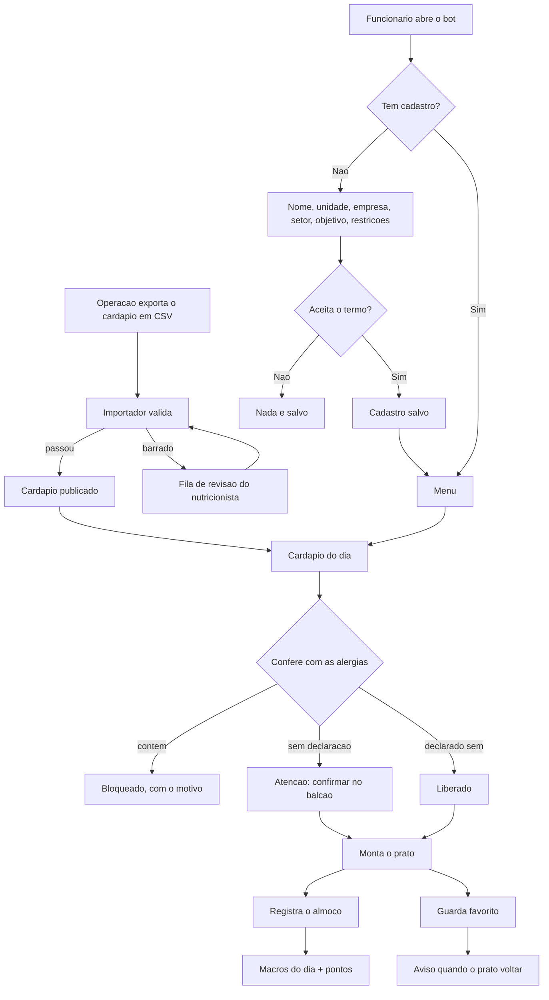

# ApetitFoodBot

Bot de controle nutricional para funcionarios atendidos pela Apetit.

A empresa serve o refeitorio; o funcionario acompanha o que come. **Nao ha venda,
preco, carrinho nem pedido.** O cardapio da operacao e importado, validado e
publicado, e o funcionario monta o prato e registra o consumo.

## O que o funcionario faz

- cadastra unidade da Apetit, empresa, setor, objetivo e restricoes alimentares
- ve o cardapio do dia **ja conferido contra as proprias alergias**
- monta o prato e ve kcal e macros somarem contra o alvo do objetivo
- registra o almoco e acumula pontos
- guarda pratos favoritos e e avisado quando voltam ao cardapio
- consulta e apaga os proprios dados quando quiser

## Comandos

| Comando | O que faz |
|---|---|
| `/start` | Cadastro ou menu principal |
| `/quanto_pegar` | Quantas conchas e colheres pegar para bater a meta |
| `/montar` | Monta o prato passo a passo, na ordem da fila |
| `/cardapio` | Cardapio de hoje com alerta de alergenico |
| `/meu_dia` | O que comeu hoje e nos dias anteriores |
| `/favoritos` | Pratos guardados |
| `/progresso` | Sequencia e conquistas da pessoa |
| `/ajuda` | Como usar |
| `/meus_dados` `/excluir_dados` | LGPD |
| `/recadastrar` | Refaz o cadastro |

Os comandos sao publicados no menu do Telegram (`setMyCommands`), entao aparecem
sozinhos na interface.

Administracao e nutricionista:

| Comando | O que faz |
|---|---|
| `/pendencias` | Fila de revisao da importacao |
| `/alergenico <prato> <alergenico> <estado>` | Declara alergenico de um prato |
| `/relatorio` | Adesao **agregada** por setor |
| `/avisar_favoritos` | Dispara aviso de prato favorito voltando |

## Rodar localmente

```powershell
python -m venv .venv
.\.venv\Scripts\Activate.ps1
pip install -r requirements.txt
Copy-Item .env.example .env
python bot.py
```

Testes:

```powershell
python -m unittest discover -s tests
```

## Decisoes de interface

O app e de acompanhamento **pessoal**. Quem usa quer comer melhor, nao ler
macronutriente. Tres decisoes seguem disso:

**Montar o prato segue a ordem da fila do refeitorio** — prato principal,
guarnicao, arroz, feijao, salada, sobremesa — uma categoria por vez, com "Passo
3 de 6". O app acompanha a bandeja em vez de mostrar uma lista unica com tudo.

**Numero vem com leitura em palavras.** "Prato leve para o seu objetivo",
"Faltam 12 g de proteina", "Sem salada nem fruta — vale somar uma". O numero fica,
mas em segundo plano. A leitura descreve onde o prato esta; nunca manda comer
menos, porque quem prescreve e o nutricionista.

**O cadastro oferece, nao pergunta codigo.** Refeitorio, empresa e setor viram
botoes com o que ja existe no banco, com saida para digitar quando for novo. O
funcionario nao sabe que a unidade dele se chama `SM` no sistema da operacao.

## Quanto pegar, em concha e colher

O funcionario nao serve gramas: ele serve concha, colher e pegador. Entao a
sugestao sai na medida do refeitorio.

```
Quanto pegar hoje
segunda-feira, 1 de setembro · objetivo: Manter o equilibrio

• 2 porcoes de File de frango grelhado
• 1 colher de Macarrao alho e oleo
• 2 colheres de Arroz parboilizado
• 1 concha de Feijao preto
• Mix de alface a vontade

Isso fecha 703 kcal e 33 g de proteina — sua meta do dia.
```

O que torna a conta simples: no cardapio da operacao **cada linha ja e uma porcao
padrao**. ARROZ PARBOILIZADO com 138 kcal e uma colher de servir; FEIJAO PRETO
com 29 kcal e uma concha. Entao a sugestao multiplica, nao converte.

Quatro regras seguram o resultado:

- **prato bloqueado nao entra** — sugerir quantidade de algo que a pessoa nao
  pode comer seria pior que nao sugerir nada
- **teto por categoria** — no maximo 3 colheres de arroz, 2 conchas de feijao;
  sem isso a conta viraria recomendacao absurda
- **sobremesa e bebida ficam de fora** — nao e papel do app empurrar pudim para
  fechar caloria
- **quando o cardapio nao alcanca o alvo, ele diz** em vez de inventar porcao

Salada entra como "a vontade": quase nao move o total e faz bem.

E sugestao, nao prescricao. Quem define quantidade individual e o nutricionista
responsavel.

## Importacao do cardapio

O cardapio chega em CSV. O importador aceita os dois layouts observados — largo
(uma linha por dia, cinco colunas por categoria) e longo (uma linha por item) —
com separador `;` ou `,` e decimal com virgula.

```powershell
python scripts/import_cardapio.py cardapio.csv --unidade SM --refeicao almoco
python scripts/import_cardapio.py --pendencias
```

Categoria com numero, como `PRATO PRINCIPAL 2`, e a mesma categoria em outro slot.

Colunas de **custo e per capita sao descartadas**: sao dado comercial da operacao
e nao podem chegar ao app do funcionario.

### Validacao antes de publicar

| Regra | Acao |
|---|---|
| Energia declarada x Atwater (4/9/4) divergindo mais de 25% **e** de 30 kcal | bloqueia |
| Macros somando mais que a porcao | bloqueia |
| Valor negativo | bloqueia |
| Macro incompleto | publica marcado como sem informacao |

O limite duplo na primeira regra e o que faz ela funcionar: so o relativo barraria
salada de 4 kcal por 2 kcal de arredondamento.

Item bloqueado **nao chega ao cardapio** — vai para a fila de revisao com o motivo,
agrupada por ficha tecnica, ja que a mesma ficha errada reaparece em varios dias
do mes e a correcao e uma so.

## Alergenicos

A lista segue os alergenicos de declaracao obrigatoria da RDC 26/2015 da ANVISA.
A conferencia tem **tres estados, nao dois**:

| Ficha tecnica diz | Resposta ao funcionario |
|---|---|
| Contem | Bloqueio, com o alergenico nomeado |
| Pode conter / tracos | Atencao — confirmar no balcao |
| **Nada** | Atencao — o app nao afirma que e seguro |
| Todos os alergenicos da pessoa como nao contem | Liberado |

**Falta de informacao nunca vira liberacao.** Deduzir alergenico do nome do prato
e o erro que machuca: "STROGONOFF DE CARNE" nao avisa que leva creme de leite,
"FILE DE FRANGO A MILANESA" nao avisa que leva ovo e trigo.

### O funcionario escreve, o app reconhece

No cadastro a pessoa escreve do jeito dela — "alergia a frutos do mar", "nao
posso leite nem ovo", "sou celiaco" — e o app traduz para os codigos da lista.
Antes de salvar, ele mostra o que entendeu para a pessoa confirmar.

| A pessoa escreve | O app entende |
|---|---|
| alergia a frutos do mar | Crustaceos + Peixes |
| intolerante a lactose | Leite e derivados |
| sou celiaco | Gluten |
| nao posso leite nem ovo | Leite + Ovos |

Duas regras seguram a honestidade:

**Nada e adivinhado por semelhanca.** So casa com sinonimo conhecido. Errar para
o lado do "reconheci" e pior que pedir para a pessoa confirmar.

**O que nao for reconhecido nao e descartado.** "Alergia a legumes" nao existe
como campo em ficha tecnica nenhuma. O termo fica guardado, aparece no cadastro
marcado como *nao conferido pelo app*, e — o ponto importante — **enquanto a
pessoa tiver um termo desses, nenhum prato aparece como liberado.** Mostrar visto
verde a quem tem restricao que o app nao checa e pior que nao mostrar nada.

Quem preferir marcar numa lista em vez de escrever tem essa saida no proprio passo.

### O nome do prato tambem conta

O cardapio ja diz em voz alta o que o prato e: "FEIJAO PRETO" tem feijao,
"SALADA DE CAMARAO" tem camarao. Entao quem escreve "nao posso feijao" tem o
prato bloqueado sem precisar de ficha tecnica nenhuma.

Isso vale **numa direcao so**: o nome prova presenca, nunca ausencia.
"Strogonoff de carne" nao ter "leite" no nome nao prova que nao leva creme de
leite. Por isso o casamento por nome bloqueia, mas nunca libera.

Casa variacao de palavra — "feijao" pega "feijoada", "carne" pega "carnes" — e
na duvida casa: um bloqueio a mais a pessoa percebe e contorna; um bloqueio a
menos ela come.

### Alergia ou so prefiro evitar

Quando o termo nao e um alergenico conhecido, o app pergunta o quanto ser
rigoroso, porque as duas coisas pedem tratamento diferente:

| A pessoa responde | O que o app faz |
|---|---|
| **E alergia** | Bloqueia pelo nome **e** avisa em todo prato que nao consegue confirmar |
| **So prefiro evitar** | Bloqueia so quando aparece no nome; fica quieto no resto |

A diferenca e grande na pratica. Num cardapio real de 13 itens, "nao posso
feijao" como alergia gera **12 avisos**; como preferencia, gera **1 bloqueio e
nenhum aviso**. Tratar preferencia com rigor de alergia enche a tela de alerta
ate a pessoa parar de ler o que importa.

### Os dois lados do alerta

O aviso so funciona cruzando duas informacoes, que vem de fontes diferentes:

| Lado | Quem informa |
|---|---|
| **A que a pessoa e alergica** | O proprio funcionario, no cadastro |
| **O que cada prato contem** | So a cozinha sabe |

O funcionario declarar a alergia dele nao resolve o segundo lado: ele sabe que
nao pode leite, mas nao tem como saber se o strogonoff de hoje leva creme de
leite. Por isso, sem o dado do prato, a resposta e "nao consigo confirmar".

### Como declarar o que cada prato contem

**1. No proprio CSV do cardapio.** Colunas como `alerg_leite` ou `contem_gluten`
sao importadas automaticamente, aceitando `sim`/`nao`/`pode conter`/`tracos`.
Celula vazia continua como nao declarado.

**2. Planilha do nutricionista**, enquanto o export nao tiver o campo:

```powershell
python scripts/alergenicos.py --exportar alergenicos.csv
# nutricionista preenche no Excel: sim / nao / pode conter
python scripts/alergenicos.py --importar alergenicos.csv
python scripts/alergenicos.py --cobertura
```

O trabalho e finito e se paga: num mes real, **110 fichas cobriram 312
ocorrencias** do cardapio. A planilha sai ordenada pelos pratos que mais
aparecem, entao declarar arroz, feijao e refresco ja resolve boa parte do
cardapio.

**3. Prato a prato**, pelo `/alergenico` no Telegram.

Acompanhe com `/cobertura` ou `--cobertura`.

## Progresso

E acompanhamento pessoal: **nao existe ranking e ninguem compara o funcionario
com colega nenhum.** O que aparece e a propria sequencia ("voce registrou 3 de 5
dias desta semana") e as proprias conquistas.

Pontuam **constancia** (registrar), **composicao** (incluir salada ou fruta),
**variedade** na semana e **meta de proteina**.

Nenhuma regra premia deficit calorico ou perda de peso, e **nao ha ranking entre
colegas**. Num app corporativo, premiar comer menos sob o olhar do empregador
empurra para uma relacao ruim com comida. Cada regra carrega o campo `basis` e ha
teste garantindo que nenhuma se apoie em deficit ou peso.

Os alvos de kcal e proteina por objetivo sao **ilustrativos**. Quem define faixa
individual e o nutricionista responsavel: o app informa e acompanha, nao prescreve.

## Privacidade

O app guarda dado de saude de funcionario dentro de uma relacao de emprego, o que
exige cuidado alem do aviso de consentimento:

- a empresa **nunca ve dado individual** — nem consumo, nem objetivo, nem restricao
- `/relatorio` mostra so adesao agregada por setor
- recorte com menos de **5 pessoas** e suprimido, porque setor pequeno mais dado
  alimentar reidentifica alguem sem precisar do nome
- `/excluir_dados` apaga cadastro, restricoes, consumo, favoritos e pontos

## Seguranca do token

Se um token foi colado em chat, issue, commit ou qualquer lugar publico, gere outro
no BotFather. Nao salve o token no codigo.

Um token de verdade ja esteve versionado no `.env.example` deste repositorio, que e
publico. O valor foi removido do arquivo, mas continua acessivel no historico do
Git, entao **esse token precisa ser revogado no BotFather** (`/revoke`) mesmo com o
arquivo atual limpo. Remover num commit posterior nao invalida a credencial.

## Comandos administrativos

`/pendencias`, `/alergenico`, `/relatorio` e `/avisar_favoritos` sao restritos.

A lista de administradores e obrigatoria: enquanto `ADMIN_TELEGRAM_IDS` estiver
vazio, **ninguem** usa esses comandos. Isso e proposital, porque `/avisar_favoritos`
dispara mensagem para a base e `/alergenico` altera informacao de seguranca alimentar.

```env
TELEGRAM_BOT_TOKEN=seu_token
ADMIN_TELEGRAM_IDS=123456789,987654321
APETIT_DB_PATH=apetit.db
```

## Deploy

Com `TELEGRAM_WEBHOOK_URL` preenchido o bot sobe em webhook; sem ela, em polling.

```env
TELEGRAM_WEBHOOK_URL=https://seu-app.onrender.com
TELEGRAM_WEBHOOK_PATH=telegram-webhook
TELEGRAM_WEBHOOK_SECRET_TOKEN=um-segredo-forte
PORT=8000
```

SQLite atende o piloto. Para operacao real, migre para PostgreSQL: em Render,
Railway ou Fly o disco e efemero e o banco some no redeploy.

Backup:

```powershell
python scripts/backup_db.py
```

## Estrutura

```
apetit/
  model.py       entidades do cardapio
  csv_import.py  leitura dos dois layouts de CSV
  validation.py  regras nutricionais de entrada
  catalog.py     persistencia, publicacao e conferencia
  allergens.py   alergenicos e verificacao em tres estados
  profile.py     cadastro e agregacao com n minimo
  tracking.py    consumo, favoritos e pontos
bot.py           camada do Telegram
```

A regra de dominio fica fora do `bot.py` de proposito, para servir depois a um
painel do nutricionista sem reescrita.

## Fluxo


