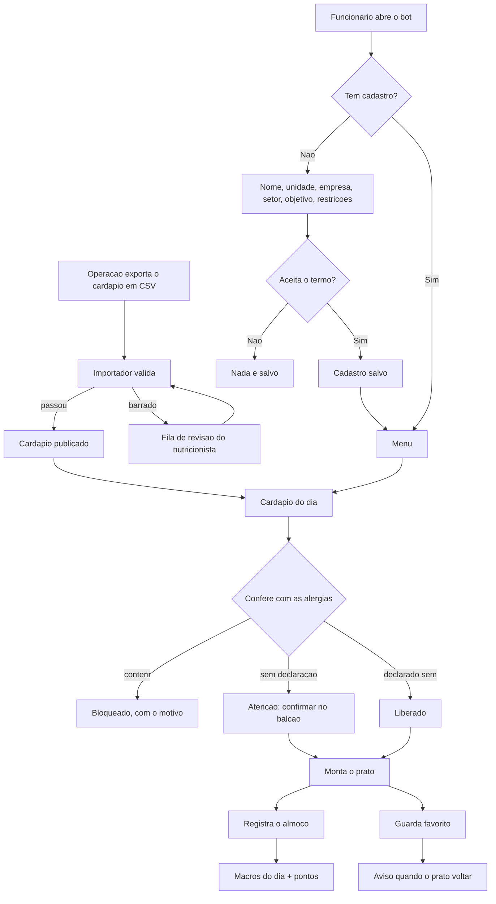

# ApetitFoodBot

Bot de controle nutricional para funcionarios atendidos pela Apetit.

A empresa serve o refeitorio; o funcionario acompanha o que come. **Nao ha venda,
preco, carrinho nem pedido.** O cardapio da operacao e importado, validado e
publicado, e o funcionario monta o prato e registra o consumo.

## O que o funcionario faz

- cadastra unidade da Apetit, empresa, setor, objetivo e restricoes alimentares
- ve o cardapio do dia **ja conferido contra as proprias alergias**
- monta o prato e ve kcal e macros somarem contra o alvo do objetivo
- registra o almoco e acumula pontos
- guarda pratos favoritos e e avisado quando voltam ao cardapio
- consulta e apaga os proprios dados quando quiser

## Comandos

| Comando | O que faz |
|---|---|
| `/start` | Cadastro ou menu principal |
| `/montar` | Monta o prato passo a passo, na ordem da fila |
| `/cardapio` | Cardapio de hoje com alerta de alergenico |
| `/meu_dia` | O que comeu hoje e nos dias anteriores |
| `/favoritos` | Pratos guardados |
| `/progresso` | Sequencia e conquistas da pessoa |
| `/ajuda` | Como usar |
| `/meus_dados` `/excluir_dados` | LGPD |
| `/recadastrar` | Refaz o cadastro |

Os comandos sao publicados no menu do Telegram (`setMyCommands`), entao aparecem
sozinhos na interface.

Administracao e nutricionista:

| Comando | O que faz |
|---|---|
| `/pendencias` | Fila de revisao da importacao |
| `/alergenico <prato> <alergenico> <estado>` | Declara alergenico de um prato |
| `/relatorio` | Adesao **agregada** por setor |
| `/avisar_favoritos` | Dispara aviso de prato favorito voltando |

## Rodar localmente

```powershell
python -m venv .venv
.\.venv\Scripts\Activate.ps1
pip install -r requirements.txt
Copy-Item .env.example .env
python bot.py
```

Testes:

```powershell
python -m unittest discover -s tests
```

## Decisoes de interface

O app e de acompanhamento **pessoal**. Quem usa quer comer melhor, nao ler
macronutriente. Tres decisoes seguem disso:

**Montar o prato segue a ordem da fila do refeitorio** — prato principal,
guarnicao, arroz, feijao, salada, sobremesa — uma categoria por vez, com "Passo
3 de 6". O app acompanha a bandeja em vez de mostrar uma lista unica com tudo.

**Numero vem com leitura em palavras.** "Prato leve para o seu objetivo",
"Faltam 12 g de proteina", "Sem salada nem fruta — vale somar uma". O numero fica,
mas em segundo plano. A leitura descreve onde o prato esta; nunca manda comer
menos, porque quem prescreve e o nutricionista.

**O cadastro oferece, nao pergunta codigo.** Refeitorio, empresa e setor viram
botoes com o que ja existe no banco, com saida para digitar quando for novo. O
funcionario nao sabe que a unidade dele se chama `SM` no sistema da operacao.

## Importacao do cardapio

O cardapio chega em CSV. O importador aceita os dois layouts observados — largo
(uma linha por dia, cinco colunas por categoria) e longo (uma linha por item) —
com separador `;` ou `,` e decimal com virgula.

```powershell
python scripts/import_cardapio.py cardapio.csv --unidade SM --refeicao almoco
python scripts/import_cardapio.py --pendencias
```

Categoria com numero, como `PRATO PRINCIPAL 2`, e a mesma categoria em outro slot.

Colunas de **custo e per capita sao descartadas**: sao dado comercial da operacao
e nao podem chegar ao app do funcionario.

### Validacao antes de publicar

| Regra | Acao |
|---|---|
| Energia declarada x Atwater (4/9/4) divergindo mais de 25% **e** de 30 kcal | bloqueia |
| Macros somando mais que a porcao | bloqueia |
| Valor negativo | bloqueia |
| Macro incompleto | publica marcado como sem informacao |

O limite duplo na primeira regra e o que faz ela funcionar: so o relativo barraria
salada de 4 kcal por 2 kcal de arredondamento.

Item bloqueado **nao chega ao cardapio** — vai para a fila de revisao com o motivo,
agrupada por ficha tecnica, ja que a mesma ficha errada reaparece em varios dias
do mes e a correcao e uma so.

## Alergenicos

A lista segue os alergenicos de declaracao obrigatoria da RDC 26/2015 da ANVISA.
A conferencia tem **tres estados, nao dois**:

| Ficha tecnica diz | Resposta ao funcionario |
|---|---|
| Contem | Bloqueio, com o alergenico nomeado |
| Pode conter / tracos | Atencao — confirmar no balcao |
| **Nada** | Atencao — o app nao afirma que e seguro |
| Todos os alergenicos da pessoa como nao contem | Liberado |

**Falta de informacao nunca vira liberacao.** Deduzir alergenico do nome do prato
e o erro que machuca: "STROGONOFF DE CARNE" nao avisa que leva creme de leite,
"FILE DE FRANGO A MILANESA" nao avisa que leva ovo e trigo.

Se o CSV trouxer colunas de alergenico (`alerg_leite`, `contem_gluten`, ...), elas
sao importadas automaticamente. Valores aceitos: `sim`/`nao`/`pode conter`/`tracos`.
Celula vazia continua como nao declarado.

Quando nao houver essas colunas, o nutricionista declara pelo `/alergenico`.

## Progresso

E acompanhamento pessoal: **nao existe ranking e ninguem compara o funcionario
com colega nenhum.** O que aparece e a propria sequencia ("voce registrou 3 de 5
dias desta semana") e as proprias conquistas.

Pontuam **constancia** (registrar), **composicao** (incluir salada ou fruta),
**variedade** na semana e **meta de proteina**.

Nenhuma regra premia deficit calorico ou perda de peso, e **nao ha ranking entre
colegas**. Num app corporativo, premiar comer menos sob o olhar do empregador
empurra para uma relacao ruim com comida. Cada regra carrega o campo `basis` e ha
teste garantindo que nenhuma se apoie em deficit ou peso.

Os alvos de kcal e proteina por objetivo sao **ilustrativos**. Quem define faixa
individual e o nutricionista responsavel: o app informa e acompanha, nao prescreve.

## Privacidade

O app guarda dado de saude de funcionario dentro de uma relacao de emprego, o que
exige cuidado alem do aviso de consentimento:

- a empresa **nunca ve dado individual** — nem consumo, nem objetivo, nem restricao
- `/relatorio` mostra so adesao agregada por setor
- recorte com menos de **5 pessoas** e suprimido, porque setor pequeno mais dado
  alimentar reidentifica alguem sem precisar do nome
- `/excluir_dados` apaga cadastro, restricoes, consumo, favoritos e pontos

## Seguranca do token

Se um token foi colado em chat, issue, commit ou qualquer lugar publico, gere outro
no BotFather. Nao salve o token no codigo.

Um token de verdade ja esteve versionado no `.env.example` deste repositorio, que e
publico. O valor foi removido do arquivo, mas continua acessivel no historico do
Git, entao **esse token precisa ser revogado no BotFather** (`/revoke`) mesmo com o
arquivo atual limpo. Remover num commit posterior nao invalida a credencial.

## Comandos administrativos

`/pendencias`, `/alergenico`, `/relatorio` e `/avisar_favoritos` sao restritos.

A lista de administradores e obrigatoria: enquanto `ADMIN_TELEGRAM_IDS` estiver
vazio, **ninguem** usa esses comandos. Isso e proposital, porque `/avisar_favoritos`
dispara mensagem para a base e `/alergenico` altera informacao de seguranca alimentar.

```env
TELEGRAM_BOT_TOKEN=seu_token
ADMIN_TELEGRAM_IDS=123456789,987654321
APETIT_DB_PATH=apetit.db
```

## Deploy

Com `TELEGRAM_WEBHOOK_URL` preenchido o bot sobe em webhook; sem ela, em polling.

```env
TELEGRAM_WEBHOOK_URL=https://seu-app.onrender.com
TELEGRAM_WEBHOOK_PATH=telegram-webhook
TELEGRAM_WEBHOOK_SECRET_TOKEN=um-segredo-forte
PORT=8000
```

SQLite atende o piloto. Para operacao real, migre para PostgreSQL: em Render,
Railway ou Fly o disco e efemero e o banco some no redeploy.

Backup:

```powershell
python scripts/backup_db.py
```

## Estrutura

```
apetit/
  model.py       entidades do cardapio
  csv_import.py  leitura dos dois layouts de CSV
  validation.py  regras nutricionais de entrada
  catalog.py     persistencia, publicacao e conferencia
  allergens.py   alergenicos e verificacao em tres estados
  profile.py     cadastro e agregacao com n minimo
  tracking.py    consumo, favoritos e pontos
bot.py           camada do Telegram
```

A regra de dominio fica fora do `bot.py` de proposito, para servir depois a um
painel do nutricionista sem reescrita.

## Fluxo


