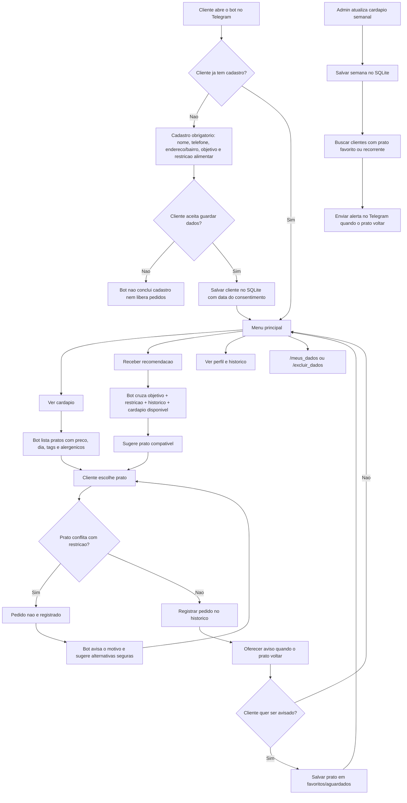

# ApetitFoodBot

MVP de bot Telegram da Apetit com fluxos inspirados no simulador HTML:

- boas-vindas com `/start`
- cadastro obrigatorio antes de pedidos
- aceite LGPD antes de salvar dados pessoais
- objetivo do cliente no cadastro: perder peso, ganhar massa, manter equilibrio, alimentacao saudavel ou praticidade
- banco SQLite com clientes e historico de pedidos
- comandos `/meus_dados` e `/excluir_dados`
- cardapio real no banco com preco, dia, ingredientes, alergenicos e tags
- cardapio do dia
- cardapio sem carne
- recomendacao inteligente baseada no cadastro e historico do cliente
- bloqueio de pedido incompatavel com restricao alimentar cadastrada
- reclamacao com escuta empatica
- feedback positivo
- alerta de restricao alimentar
- perfil nutricional demonstrativo

## Seguranca do token

Se um token foi colado em chat, issue, commit ou qualquer lugar publico, gere outro no BotFather.
Nao salve o token diretamente no codigo.

Um token de verdade ja esteve versionado no `.env.example` deste repositorio, que e publico. O valor foi removido do arquivo, mas continua acessivel no historico do Git, entao **esse token precisa ser revogado no BotFather** (`/revoke`) mesmo que o arquivo atual esteja limpo. Remover de um commit posterior nao invalida a credencial.

## Rodar localmente

```powershell
python -m venv .venv
.\.venv\Scripts\Activate.ps1
pip install -r requirements.txt
Copy-Item .env.example .env
```

Edite o arquivo `.env` e coloque o token novo:

```env
TELEGRAM_BOT_TOKEN=seu_token_novo
APETIT_USER_NAME=Mariana
APETIT_DB_PATH=apetit.db
```

Depois inicie:

```powershell
python bot.py
```

Para rodar os testes:

```powershell
python -m unittest discover -s tests
```

No Telegram, abra o bot e envie:

```text
/start
```

O bot vai pedir nome, telefone, endereco/bairro, objetivo alimentar, restricao alimentar e aceite LGPD antes de liberar cardapio, recomendacoes ou pedidos.
Quando o cliente escolhe um prato, o bot confere os alergenicos, ingredientes e tags antes de registrar o pedido. Se houver conflito com a restricao cadastrada, o pedido nao e gravado e o bot sugere alternativas mais seguras.
As recomendacoes consideram o objetivo do cliente e o historico de pedidos.

Para refazer o cadastro, envie:

```text
/recadastrar
```

Para ver o historico de pedidos:

```text
/historico
```

Para ver o cardapio disponivel:

```text
/cardapio
```

Para consultar ou excluir os dados do cliente:

```text
/meus_dados
/excluir_dados
```

## Banco de dados

O bot cria automaticamente o arquivo `apetit.db` com:

- clientes cadastrados
- aceite LGPD e data do consentimento
- historico de pedidos
- pratos cadastrados no cardapio
- pratos favoritos/aguardados
- atualizacoes de cardapio semanal

Esse arquivo fica fora do Git por seguranca e privacidade.

## LGPD e consentimento

Como o bot guarda telefone, endereco/bairro, historico e preferencias, o cadastro so e concluido depois do aceite do cliente.

O cliente pode:

- ver os dados salvos com `/meus_dados`
- excluir cadastro, historico e favoritos com `/excluir_dados`
- refazer o cadastro com `/recadastrar`

O banco guarda `consent_accepted` e `consented_at`. Se o cliente nao aceitar, o bot nao conclui o cadastro nem libera pedidos.

## Grafo do fluxo



## Cadastrar pratos

Administradores podem cadastrar ou atualizar pratos assim:

```text
/cardapio_add Nome do prato | 29,90 | segunda | ingredientes | alergenicos | tags | disponivel
```

Exemplo:

```text
/cardapio_add Frango Grelhado | 31,90 | quinta | frango, arroz, legumes | nenhum | proteico, caseiro | sim
```

Para listar o cardapio cadastrado:

```text
/cardapio_list
```

Para ver um resumo administrativo com clientes, pedidos, favoritos e pratos mais pedidos:

```text
/relatorio
```

## Atualizar cardapio semanal

Envie o comando abaixo no Telegram para registrar os pratos da semana e avisar clientes que aguardam algum deles ou ja pediram o prato varias vezes:

```text
/cardapio_semana Lasanha de Legumes
Peixe Assado com Legumes
Sopa de Lentilha
```

## Comandos administrativos

`/cardapio_add`, `/cardapio_list`, `/cardapio_semana` e `/relatorio` sao restritos a administradores.

A lista de administradores e obrigatoria: enquanto `ADMIN_TELEGRAM_IDS` estiver vazio, **ninguem** consegue usar esses comandos. Isso e proposital, porque `/relatorio` expoe nome de clientes e historico de pedidos e `/cardapio_semana` dispara mensagem para toda a base.

```env
ADMIN_TELEGRAM_IDS=123456789,987654321
APETIT_DB_PATH=apetit.db
```

## Deploy

Para operar de verdade, use webhook em producao e deixe polling apenas para testes locais.

Variaveis recomendadas:

```env
TELEGRAM_BOT_TOKEN=seu_token_novo
ADMIN_TELEGRAM_IDS=123456789
APETIT_DB_PATH=apetit.db
TELEGRAM_WEBHOOK_URL=https://seu-app.onrender.com
TELEGRAM_WEBHOOK_PATH=telegram-webhook
TELEGRAM_WEBHOOK_SECRET_TOKEN=um-segredo-forte
PORT=8000
```

Com `TELEGRAM_WEBHOOK_URL` preenchido, o bot sobe com webhook automaticamente. Sem essa variavel, ele continua usando polling.

Opcoes de hospedagem:

- Render, Railway ou Fly para uma primeira versao gerenciada
- VPS quando voce quiser mais controle de sistema, disco e backups
- SQLite funciona para MVP; para escala maior, considere migrar para PostgreSQL

Backup do banco:

```powershell
python scripts/backup_db.py
```

O script cria uma copia em `backups/`. Em producao, agende esse comando no provedor ou na VPS e guarde copias fora da maquina principal.

Logs e monitoramento:

- os logs saem no stdout do processo, que Render/Railway/Fly/VPS conseguem capturar
- monitore reinicios, erros de webhook e espaco em disco
- mantenha um alerta simples para queda do servico e falhas de backup

## Checklist antes de usar com clientes

- gerar um token novo no BotFather se o token antigo foi exposto
- preencher `TELEGRAM_BOT_TOKEN` no `.env`
- configurar `ADMIN_TELEGRAM_IDS` para proteger comandos administrativos
- preencher `TELEGRAM_WEBHOOK_URL` em producao
- configurar rotina de backup do banco
- cadastrar pratos reais com ingredientes, alergenicos e tags
- testar um cadastro novo com `/start`
- testar aceite LGPD, `/meus_dados` e `/excluir_dados`
- testar objetivos diferentes, como perder peso e ganhar massa
- testar uma restricao alimentar e confirmar que prato incompatavel e bloqueado
- testar `/cardapio_semana` com um prato favorito para confirmar o alerta

## Exemplos de frases

- `O que tem hoje sem carne?`
- `O que voce recomenda hoje?`
- `A comida estava fria.`
- `Gostei muito do almoco de hoje!`
- `Posso pedir o estrogonofe de cogumelos?`
