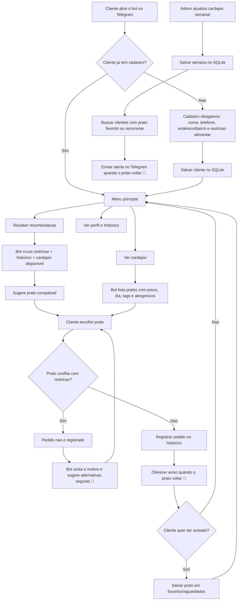

# ApetitFoodBot

MVP de bot Telegram da Apetit com fluxos inspirados no simulador HTML:

- boas-vindas com `/start`
- cadastro obrigatorio antes de pedidos
- banco SQLite com clientes e historico de pedidos
- cardapio real no banco com preco, dia, ingredientes, alergenicos e tags
- cardapio do dia
- cardapio sem carne
- recomendacao inteligente baseada no cadastro e historico do cliente
- bloqueio de pedido incompatavel com restricao alimentar cadastrada
- reclamacao com escuta empatica
- feedback positivo
- alerta de restricao alimentar
- perfil nutricional demonstrativo

## Seguranca do token

Se um token foi colado em chat, issue, commit ou qualquer lugar publico, gere outro no BotFather.
Nao salve o token diretamente no codigo.

## Rodar localmente

```powershell
python -m venv .venv
.\.venv\Scripts\Activate.ps1
pip install -r requirements.txt
Copy-Item .env.example .env
```

Edite o arquivo `.env` e coloque o token novo:

```env
TELEGRAM_BOT_TOKEN=seu_token_novo
APETIT_USER_NAME=Mariana
```

Depois inicie:

```powershell
python bot.py
```

Para rodar os testes:

```powershell
python -m unittest discover -s tests
```

No Telegram, abra o bot e envie:

```text
/start
```

O bot vai pedir nome, telefone, endereco/bairro e restricao alimentar antes de liberar cardapio, recomendacoes ou pedidos.
Quando o cliente escolhe um prato, o bot confere os alergenicos, ingredientes e tags antes de registrar o pedido. Se houver conflito com a restricao cadastrada, o pedido nao e gravado e o bot sugere alternativas mais seguras.

Para refazer o cadastro, envie:

```text
/recadastrar
```

Para ver o historico de pedidos:

```text
/historico
```

Para ver o cardapio disponivel:

```text
/cardapio
```

## Banco de dados

O bot cria automaticamente o arquivo `apetit.db` com:

- clientes cadastrados
- historico de pedidos
- pratos cadastrados no cardapio
- pratos favoritos/aguardados
- atualizacoes de cardapio semanal

Esse arquivo fica fora do Git por seguranca e privacidade.

## Grafo do fluxo



## Cadastrar pratos

Administradores podem cadastrar ou atualizar pratos assim:

```text
/cardapio_add Nome do prato | 29,90 | segunda | ingredientes | alergenicos | tags | disponivel
```

Exemplo:

```text
/cardapio_add Frango Grelhado | 31,90 | quinta | frango, arroz, legumes | nenhum | proteico, caseiro | sim
```

Para listar o cardapio cadastrado:

```text
/cardapio_list
```

## Atualizar cardapio semanal

Envie o comando abaixo no Telegram para registrar os pratos da semana e avisar clientes que aguardam algum deles ou ja pediram o prato varias vezes:

```text
/cardapio_semana Lasanha de Legumes
Peixe Assado com Legumes
Sopa de Lentilha
```

Para restringir esse comando a administradores, configure no `.env`:

```env
ADMIN_TELEGRAM_IDS=123456789,987654321
APETIT_DB_PATH=apetit.db
```

## Checklist antes de usar com clientes

- gerar um token novo no BotFather se o token antigo foi exposto
- preencher `TELEGRAM_BOT_TOKEN` no `.env`
- configurar `ADMIN_TELEGRAM_IDS` para proteger comandos administrativos
- cadastrar pratos reais com ingredientes, alergenicos e tags
- testar um cadastro novo com `/start`
- testar uma restricao alimentar e confirmar que prato incompatavel e bloqueado
- testar `/cardapio_semana` com um prato favorito para confirmar o alerta

## Exemplos de frases

- `O que tem hoje sem carne?`
- `O que voce recomenda hoje?`
- `A comida estava fria.`
- `Gostei muito do almoco de hoje!`
- `Posso pedir o estrogonofe de cogumelos?`
