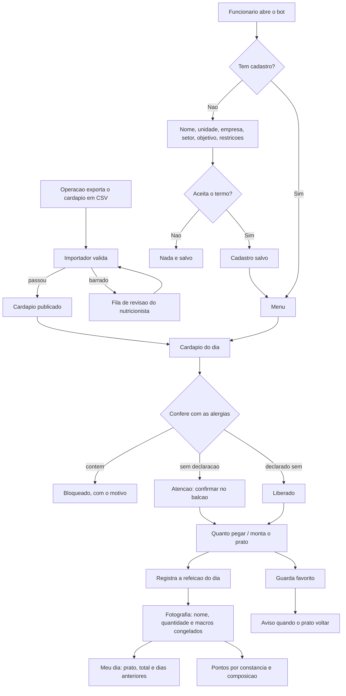

# ApetitFoodBot

Bot de controle nutricional para funcionarios atendidos pela Apetit.

A empresa serve o refeitorio; o funcionario acompanha o que come. **Nao ha venda,
preco, carrinho nem pedido.** O cardapio da operacao e importado, validado e
publicado, e o funcionario monta o prato e registra o consumo.

## O que o funcionario faz

- cadastra unidade da Apetit, empresa, setor, objetivo e restricoes alimentares
- ve o cardapio do dia **ja conferido contra as proprias alergias**
- monta o prato e ve kcal e macros somarem contra o alvo do objetivo
- registra o almoco e acumula pontos
- guarda pratos favoritos e e avisado quando voltam ao cardapio
- **avalia o refeitorio** — comida, atendimento e o que faltou — sem se
  identificar para a empresa
- consulta e apaga os proprios dados quando quiser

## Comandos

| Comando | O que faz |
|---|---|
| `/start` | Cadastro ou menu principal |
| `/quanto_pegar` | Quantas conchas e colheres pegar para bater a meta |
| `/montar` | Monta o prato passo a passo, na ordem da fila |
| `/cardapio` | Cardapio de hoje com alerta de alergenico |
| `/avaliar` | Avalia o refeitorio de hoje (comida, atendimento, falta) |
| `/meu_dia` | O que comeu hoje e nos dias anteriores |
| `/favoritos` | Pratos guardados |
| `/progresso` | Sequencia e conquistas da pessoa |
| `/ajuda` | Como usar |
| `/meus_dados` `/excluir_dados` | LGPD |
| `/recadastrar` | Refaz o cadastro |

Os comandos sao publicados no menu do Telegram (`setMyCommands`), entao aparecem
sozinhos na interface.

Administracao e nutricionista:

| Comando | O que faz |
|---|---|
| `/pendencias` | Fila de revisao da importacao |
| `/alergenico <prato> <alergenico> <estado>` | Declara alergenico de um prato |
| `/relatorio` | Adesao **agregada** por setor |
| `/atendimento [refeitorio]` | Como cada refeitorio esta sendo avaliado, **sempre agregado** |
| `/avisar_favoritos` | Dispara aviso de prato favorito voltando |

## Rodar localmente

```powershell
python -m venv .venv
.\.venv\Scripts\Activate.ps1
pip install -r requirements.txt
Copy-Item .env.example .env
python bot.py
```

Testes:

```powershell
python -m unittest discover -s tests
```

## Decisoes de interface

O app e de acompanhamento **pessoal**. Quem usa quer comer melhor, nao ler
macronutriente. Tres decisoes seguem disso:

**Montar o prato segue a ordem da fila do refeitorio** — prato principal,
guarnicao, arroz, feijao, salada, sobremesa — uma categoria por vez, com "Passo
3 de 6". O app acompanha a bandeja em vez de mostrar uma lista unica com tudo.

**Numero vem com leitura em palavras.** "Prato leve para o seu objetivo",
"Faltam 12 g de proteina", "Sem salada nem fruta — vale somar uma". O numero fica,
mas em segundo plano. A leitura descreve onde o prato esta; nunca manda comer
menos, porque quem prescreve e o nutricionista.

**O cadastro oferece, nao pergunta codigo.** Refeitorio, empresa e setor viram
botoes com o que ja existe no banco, com saida para digitar quando for novo. O
funcionario nao sabe que a unidade dele se chama `SM` no sistema da operacao.

## Quanto pegar, em concha e colher

O funcionario nao serve gramas: ele serve concha, colher e pegador. Entao a
sugestao sai na medida do refeitorio.

```
Quanto pegar hoje
segunda-feira, 1 de setembro · objetivo: Manter o equilibrio

• 1 porcao de File de frango grelhado
• 2 colheres de Macarrao alho e oleo
• 2 colheres de Arroz parboilizado
• 1 concha de Feijao preto
• Mix de alface a vontade

Isso da 711 kcal e 44 g de proteina. E a sua meta do dia.
```

O que torna a conta simples: no cardapio da operacao **cada linha ja e uma porcao
padrao**. ARROZ PARBOILIZADO com 138 kcal e uma colher de servir; FEIJAO PRETO
com 29 kcal e uma concha. Entao a sugestao multiplica, nao converte.

Cinco regras seguram o resultado:

- **prato bloqueado nao entra** — sugerir quantidade de algo que a pessoa nao
  pode comer seria pior que nao sugerir nada
- **teto por categoria** — no maximo 3 colheres de arroz, 2 conchas de feijao;
  sem isso a conta viraria recomendacao absurda
- **o prato principal so se repete enquanto falta proteina** — depois da meta
  fechada ele e apenas a opcao mais calorica da bandeja, e repetir viraria
  "pegue duas porcoes de carne" so para fechar energia. Energia que falta se
  fecha com arroz e guarnicao
- **sobremesa e bebida ficam de fora** — nao e papel do app empurrar pudim para
  fechar caloria
- **quando o cardapio nao alcanca o alvo, ele diz** em vez de inventar porcao

O fecho cobra proteina e energia separadamente: bater a proteina e ficar 200
kcal abaixo do alvo nao e "a meta do dia", e anunciar assim faria o app declarar
cumprido o que nao cumpriu.

Salada entra como "a vontade": quase nao move o total e faz bem.

E sugestao, nao prescricao. Quem define quantidade individual e o nutricionista
responsavel.

## Historico do funcionario

Da tela de sugestao sai um botao so: **Vou pegar isso**. Um toque grava a refeicao
do dia com as quantidades sugeridas. Quem prefere ajustar usa **Montar meu prato**
e marca item por item. Nos dois casos, registrar de novo no mesmo dia substitui o
registro anterior — nao empilha.

O `/meu_dia` devolve o prato do jeito que foi pego, com o total do dia e os dias
anteriores:

```
Meu dia

Prato equilibrado para o seu objetivo.
Tem salada no prato.

• Carne assada ao molho — 2 porcoes
• Arroz parboilizado — 2 colheres
• Feijao preto — 1 concha
• Mix de alface — 1 pegador

703 kcal · 33 g de proteina

Seu historico
sexta-feira, 29 de agosto — 612 kcal · 28 g ptn
• ...
```

### O historico e fotografia, nao ponteiro

A tabela `consumption` guarda **nome, categoria, quantidade e macros congelados no
momento do registro**, e nao uma referencia viva para a ficha tecnica.

O motivo e concreto: a operacao reimporta cardapio e corrige ficha tecnica o tempo
todo. Se o historico apontasse para `menu_item`, corrigir o macro de um prato em
novembro mudaria retroativamente o que a pessoa comeu em setembro. Histórico que
muda sozinho nao serve para acompanhar nada.

Consequencias praticas:

- corrigir a ficha tecnica afeta o **proximo** registro, nunca os anteriores
- item que sai do cardapio nao apaga o registro de quem comeu; o que fica nulo e o
  macro, e o total do dia se declara incompleto em vez de fingir zero
- quantidade e coluna: "2 conchas" e uma linha com `quantity = 2`, entao o total do
  dia multiplica em vez de contar item repetido

Bancos criados antes dessa mudanca sao migrados no `init_schema`: as colunas novas
sao criadas e preenchidas com o que a ficha tecnica diz no momento da migracao — a
melhor aproximacao disponivel para um registro feito antes de existir fotografia.
A partir dali o valor para de mudar sozinho.

## Importacao do cardapio

O cardapio chega em CSV ou `.xlsx`. O importador aceita os tres layouts
observados, com separador `;` ou `,` e decimal com virgula:

| Layout | Como e | Traz macro? |
|---|---|---|
| **largo** | uma linha por dia, cinco colunas por categoria (NOME, KCAL, CHO, LIP, PTN) | sim |
| **longo** | uma linha por item, colunas nomeadas | sim |
| **planejamento** | uma linha por dia, uma coluna por categoria, tudo grudado na celula | **nao** |

```powershell
python scripts/import_cardapio.py cardapio.csv --unidade SM --refeicao almoco
python scripts/import_cardapio.py Cardapio_17_a_2108.xlsx --unidade SM --mes 8 --ano 2025
python scripts/import_cardapio.py --pendencias
```

Categoria com numero, como `PRATO PRINCIPAL 2`, e a mesma categoria em outro slot.

### A planilha de planejamento

E o formato que a operacao manda toda semana. Cada celula junta quatro coisas:

```
BIFE ACEBOLADO (80g) - C51 - 3.11
└─ nome         └ porcao └ ficha └ custo per capita
```

O importador separa os quatro. **O custo morre na leitura** — e dado comercial
da Apetit e nao existe caminho por onde ele chegue ao app do funcionario; ha
teste garantindo isso. A porcao entre parenteses vira `portion_g`, e o codigo
da ficha entra no identificador do item, que e o gancho para casar esta
planilha com a que tiver os macros.

Tres detalhes que o formato exige:

- **O nome pode conter o proprio separador** (`KIT - QUIMICO - A. YOSHII`).
  Por isso o que sobra depois de tirar as pontas conhecidas e remontado
  inteiro, em vez de o parser chutar qual pedaco e o nome.
- **Colunas de insumo sao descartadas** — descartaveis, produto de limpeza,
  kit de tempero e de galeteiro nao sao comida que alguem se serve.
- **A coluna do dia traz so o numero** (`17`), sem mes nem ano. Sem `--mes` e
  `--ano` a importacao **para**, em vez de chutar: um mes errado publicaria o
  cardapio da semana no dia errado.

Importar planejamento por cima de uma ficha tecnica ja carregada **nao apaga os
macros** — todo campo nutricional entra por `COALESCE`, entao valor novo
nao-nulo vence e ausencia preserva o que estava la.

### Ausencia de macro nunca vira zero

A mesma invariante que vale para alergenico vale para valor nutricional: o que
o app nao sabe, ele nao afirma.

Somar item sem macro como zero produzia isto, para quem pegou carne, arroz,
feijao e salada de um cardapio sem ficha tecnica:

```
Prato leve para o seu objetivo de hoje.
Faltam 30 g de proteina para o seu alvo.
0 kcal · 0 g proteina
```

Nada ali era verdade. Hoje a leitura do prato recebe quantos itens sao
legiveis, e:

- **nenhum legivel** — o app nao classifica o prato: "ainda nao consigo ler
  este prato"
- **parte legivel** — o total vira piso explicito ("no minimo 280 kcal") e o
  prato tambem nao e classificado, porque classificar soma incompleta e
  afirmar o que nao se sabe
- **tudo legivel** — leitura normal

Item so conta como legivel tendo **kcal e proteina**: e o par que o app usa para
dizer qualquer coisa, e so kcal deixava a proteina entrar como zero silencioso.
A composicao do prato ("sem salada nem fruta") continua sendo lida sem macro
nenhum, porque para isso a categoria basta.

### O que essa planilha sozinha nao resolve

Ela nao tem valor nutricional nenhum. Com so ela no banco, a semana de 17 a 21
importa 80 itens em 5 dias e o funcionario ve o cardapio inteiro, organizado na
ordem da fila — mas:

- **`/quanto_pegar` nao responde.** Sem kcal e proteina nao ha o que sugerir, e
  o app diz isso em vez de inventar porcao.
- **`/meu_dia` registra o prato, com total zerado.** A fotografia guarda o que
  foi pego; os macros ficam nulos e o dia se declara incompleto.
- **Todo prato aparece como ⚠️** para quem tem alergia declarada, porque sem
  ficha tecnica nao da para afirmar que e seguro.

Falta a ficha tecnica com os macros. Como o codigo dela (`C51`,
`06.03.01.258`) ja vem nesta planilha, os dois arquivos casam pelo codigo assim
que o segundo existir.

Colunas de **custo e per capita sao descartadas**: sao dado comercial da operacao
e nao podem chegar ao app do funcionario.

### Validacao antes de publicar

| Regra | Acao |
|---|---|
| Energia declarada x Atwater (4/9/4) divergindo mais de 25% **e** de 30 kcal | bloqueia |
| Macros somando mais que a porcao | bloqueia |
| Valor negativo | bloqueia |
| Macro incompleto | publica marcado como sem informacao |

O limite duplo na primeira regra e o que faz ela funcionar: so o relativo barraria
salada de 4 kcal por 2 kcal de arredondamento.

Item bloqueado **nao chega ao cardapio** — vai para a fila de revisao com o motivo,
agrupada por ficha tecnica, ja que a mesma ficha errada reaparece em varios dias
do mes e a correcao e uma so.

## Alergenicos

A lista segue os alergenicos de declaracao obrigatoria da RDC 26/2015 da ANVISA.
A conferencia tem **tres estados, nao dois**:

| Ficha tecnica diz | Resposta ao funcionario |
|---|---|
| Contem | Bloqueio, com o alergenico nomeado |
| Pode conter / tracos | Atencao — confirmar no balcao |
| **Nada** | Atencao — o app nao afirma que e seguro |
| Todos os alergenicos da pessoa como nao contem | Liberado |

**Falta de informacao nunca vira liberacao.** Deduzir alergenico do nome do prato
e o erro que machuca: "STROGONOFF DE CARNE" nao avisa que leva creme de leite,
"FILE DE FRANGO A MILANESA" nao avisa que leva ovo e trigo.

### O funcionario escreve, o app reconhece

No cadastro a pessoa escreve do jeito dela — "alergia a frutos do mar", "nao
posso leite nem ovo", "sou celiaco" — e o app traduz para os codigos da lista.
Antes de salvar, ele mostra o que entendeu para a pessoa confirmar.

| A pessoa escreve | O app entende |
|---|---|
| alergia a frutos do mar | Crustaceos + Peixes |
| intolerante a lactose | Leite e derivados |
| sou celiaco | Gluten |
| nao posso leite nem ovo | Leite + Ovos |

Duas regras seguram a honestidade:

**Nada e adivinhado por semelhanca.** So casa com sinonimo conhecido. Errar para
o lado do "reconheci" e pior que pedir para a pessoa confirmar.

**O que nao for reconhecido nao e descartado.** "Alergia a legumes" nao existe
como campo em ficha tecnica nenhuma. O termo fica guardado, aparece no cadastro
marcado como *nao conferido pelo app*, e — o ponto importante — **enquanto a
pessoa tiver um termo desses, nenhum prato aparece como liberado.** Mostrar visto
verde a quem tem restricao que o app nao checa e pior que nao mostrar nada.

Quem preferir marcar numa lista em vez de escrever tem essa saida no proprio passo.

### O nome do prato tambem conta

O cardapio ja diz em voz alta o que o prato e: "FEIJAO PRETO" tem feijao,
"SALADA DE CAMARAO" tem camarao. Entao quem escreve "nao posso feijao" tem o
prato bloqueado sem precisar de ficha tecnica nenhuma.

Isso vale **numa direcao so**: o nome prova presenca, nunca ausencia.
"Strogonoff de carne" nao ter "leite" no nome nao prova que nao leva creme de
leite. Por isso o casamento por nome bloqueia, mas nunca libera.

Casa variacao de palavra — "feijao" pega "feijoada", "carne" pega "carnes" — e
na duvida casa: um bloqueio a mais a pessoa percebe e contorna; um bloqueio a
menos ela come.

### Alergia ou so prefiro evitar

Quando o termo nao e um alergenico conhecido, o app pergunta o quanto ser
rigoroso, porque as duas coisas pedem tratamento diferente:

| A pessoa responde | O que o app faz |
|---|---|
| **E alergia** | Bloqueia pelo nome **e** avisa em todo prato que nao consegue confirmar |
| **So prefiro evitar** | Bloqueia so quando aparece no nome; fica quieto no resto |

A diferenca e grande na pratica. Num cardapio real de 13 itens, "nao posso
feijao" como alergia gera **12 avisos**; como preferencia, gera **1 bloqueio e
nenhum aviso**. Tratar preferencia com rigor de alergia enche a tela de alerta
ate a pessoa parar de ler o que importa.

### Os dois lados do alerta

O aviso so funciona cruzando duas informacoes, que vem de fontes diferentes:

| Lado | Quem informa |
|---|---|
| **A que a pessoa e alergica** | O proprio funcionario, no cadastro |
| **O que cada prato contem** | So a cozinha sabe |

O funcionario declarar a alergia dele nao resolve o segundo lado: ele sabe que
nao pode leite, mas nao tem como saber se o strogonoff de hoje leva creme de
leite. Por isso, sem o dado do prato, a resposta e "nao consigo confirmar".

### Como declarar o que cada prato contem

**1. No proprio CSV do cardapio.** Colunas como `alerg_leite` ou `contem_gluten`
sao importadas automaticamente, aceitando `sim`/`nao`/`pode conter`/`tracos`.
Celula vazia continua como nao declarado.

**2. Planilha do nutricionista**, enquanto o export nao tiver o campo:

```powershell
python scripts/alergenicos.py --exportar alergenicos.csv
# nutricionista preenche no Excel: sim / nao / pode conter
python scripts/alergenicos.py --importar alergenicos.csv
python scripts/alergenicos.py --cobertura
```

O trabalho e finito e se paga: num mes real, **110 fichas cobriram 312
ocorrencias** do cardapio. A planilha sai ordenada pelos pratos que mais
aparecem, entao declarar arroz, feijao e refresco ja resolve boa parte do
cardapio.

**3. Prato a prato**, pelo `/alergenico` no Telegram.

Acompanhe com `/cobertura` ou `--cobertura`.

## Progresso

E acompanhamento pessoal: **nao existe ranking e ninguem compara o funcionario
com colega nenhum.** O que aparece e a propria sequencia ("voce registrou 3 de 5
dias desta semana") e as proprias conquistas.

Pontuam **constancia** (registrar), **composicao** (incluir salada ou fruta),
**variedade** na semana e **meta de proteina**.

Nenhuma regra premia deficit calorico ou perda de peso, e **nao ha ranking entre
colegas**. Num app corporativo, premiar comer menos sob o olhar do empregador
empurra para uma relacao ruim com comida. Cada regra carrega o campo `basis` e ha
teste garantindo que nenhuma se apoie em deficit ou peso.

Os alvos de kcal e proteina por objetivo sao **ilustrativos**. Quem define faixa
individual e o nutricionista responsavel: o app informa e acompanha, nao prescreve.

## Avaliacao do refeitorio

Depois de registrar a refeicao, o app pergunta como foi. Sao tres toques —
quem avalia esta na fila, de bandeja na mao:

```
A comida estava boa?     😋 Boa  · 😐 Regular · 😞 Ruim
E o atendimento?         😋 Bom  · 😐 Regular · 😞 Ruim
Faltou alguma coisa?     👍 Nao  · 👎 Sim → o que faltou
```

Comentario escrito e opcional. O convite so aparece se a pessoa ainda nao
avaliou naquele dia: pedir de novo o que ela ja respondeu e o caminho mais
rapido para ela parar de responder.

A escala e de tres niveis de proposito. Cinco estrelas viram indecisao na fila,
e o que a operacao precisa saber e se da para servir na segunda-feira, nao a
diferenca entre 3,4 e 3,6.

### A parte delicada: isto e o unico dado que a empresa le

Todo o resto do app e privado do funcionario — o que ele come, seu objetivo,
suas restricoes, a empresa nunca ve. Aqui o fluxo se inverte, e isso cria um
risco que precisa ser resolvido no desenho, nao na politica de uso:

> quem reclama do refeitorio esta reclamando do servico contratado pela propria
> empresa onde trabalha. Se a avaliacao chegasse identificada, o funcionario que
> disse "faltou comida" ficaria exposto a retaliacao — e o proximo aprenderia a
> mentir na avaliacao.

Quatro decisoes saem dai, todas com teste:

- **A linha de avaliacao nao tem coluna de empresa nem de setor.** Ela e sobre o
  refeitorio. Guardar o setor criaria exatamente o cruzamento que reidentifica
  ("a unica pessoa da manutencao que almocou terca"). Nao existe a coluna, entao
  nao ha como consultar por ali depois.
- **Nenhuma leitura para a gestao seleciona `telegram_id`.** Ele existe na tabela
  so para tres coisas: uma avaliacao por dia, a pessoa poder rever e trocar a
  propria, e a exclusao total quando ela pedir.
- **Abaixo de 5 avaliacoes no periodo, o recorte e suprimido** — media de tres
  pessoas nao e media, e opiniao identificavel.
- **Comentario escrito so sai com volume**, e em ordem alfabetica, nunca
  cronologica: a ordem de chegada cruzada com quem almocou no dia tambem aponta
  para uma pessoa.

A primeira tela diz isso ao funcionario antes da primeira pergunta. Quem nao
sabe que esta protegido responde como se nao estivesse.

Nao existe nota para funcionario do balcao por nome. Avaliacao individual de
trabalhador por trabalhador nao e problema de app, e viraria outra fonte de
retaliacao — do outro lado do balcao.

### O historico de atendimento

`/atendimento` lista os refeitorios do ultimo mes, **o pior primeiro**: o
relatorio existe para achar o refeitorio com problema, nao para exibir o que vai
bem.

```
Refeitorio Fabrica II: 24 avaliacoes · comida boa 62% · atendimento bom 46% · faltou algo em 42%
Refeitorio Administrativo: 24 avaliacoes · comida boa 92% · atendimento bom 92%
Refeitorio Central: 24 avaliacoes · comida boa 96% · atendimento bom 83%
```

`/atendimento <refeitorio>` abre o detalhe, com a serie semanal:

```
segunda-feira, 1 de setembro: 100% comida boa (12 avaliacoes)
segunda-feira, 8 de setembro:  25% comida boa (12 avaliacoes)

o que faltou: Acabou antes de eu chegar — 10x
```

A serie semanal existe porque a media do mes esconde a semana em que o
refeitorio caiu — nos numeros acima, a media do periodo diz 62% e some com a
queda de 100% para 25%.

O percentual ignora quem pulou aquela pergunta: quem nao deu nota de atendimento
nao conta como atendimento ruim.

## Privacidade

O app guarda dado de saude de funcionario dentro de uma relacao de emprego, o que
exige cuidado alem do aviso de consentimento:

- a empresa **nunca ve dado individual** — nem consumo, nem objetivo, nem restricao
- `/relatorio` mostra so adesao agregada por setor
- `/atendimento` mostra so media de refeitorio, suprimida abaixo de 5 avaliacoes,
  e a avaliacao nao guarda empresa nem setor de quem respondeu
- recorte com menos de **5 pessoas** e suprimido, porque setor pequeno mais dado
  alimentar reidentifica alguem sem precisar do nome
- `/excluir_dados` apaga cadastro, restricoes, consumo, favoritos e pontos

## Seguranca do token

Se um token foi colado em chat, issue, commit ou qualquer lugar publico, gere outro
no BotFather. Nao salve o token no codigo.

Um token de verdade ja esteve versionado no `.env.example` deste repositorio, que e
publico. O valor foi removido do arquivo, mas continua acessivel no historico do
Git, entao **esse token precisa ser revogado no BotFather** (`/revoke`) mesmo com o
arquivo atual limpo. Remover num commit posterior nao invalida a credencial.

## Comandos administrativos

`/pendencias`, `/alergenico`, `/relatorio`, `/atendimento` e `/avisar_favoritos`
sao restritos.

A lista de administradores e obrigatoria: enquanto `ADMIN_TELEGRAM_IDS` estiver
vazio, **ninguem** usa esses comandos. Isso e proposital, porque `/avisar_favoritos`
dispara mensagem para a base e `/alergenico` altera informacao de seguranca alimentar.

```env
TELEGRAM_BOT_TOKEN=seu_token
ADMIN_TELEGRAM_IDS=123456789,987654321
APETIT_DB_PATH=apetit.db
```

## Deploy

Com `TELEGRAM_WEBHOOK_URL` preenchido o bot sobe em webhook; sem ela, em polling.

```env
TELEGRAM_WEBHOOK_URL=https://seu-app.onrender.com
TELEGRAM_WEBHOOK_PATH=telegram-webhook
TELEGRAM_WEBHOOK_SECRET_TOKEN=um-segredo-forte
PORT=8000
```

SQLite atende o piloto. Para operacao real, migre para PostgreSQL: em Render,
Railway ou Fly o disco e efemero e o banco some no redeploy.

Backup:

```powershell
python scripts/backup_db.py
```

## Estrutura

```
apetit/
  model.py       entidades do cardapio
  csv_import.py  leitura dos tres layouts de cardapio
  spreadsheet.py planilha do Excel -> as mesmas linhas do CSV
  validation.py  regras nutricionais de entrada
  catalog.py     persistencia, publicacao e conferencia
  allergens.py   alergenicos e verificacao em tres estados
  profile.py     cadastro e agregacao com n minimo
  portions.py    quanto pegar, em concha e colher
  humanize.py    o texto que o funcionario le
  tracking.py    historico congelado, favoritos e pontos
  feedback.py    avaliacao do refeitorio, agregada e sem autor
bot.py           camada do Telegram
```

A regra de dominio fica fora do `bot.py` de proposito, para servir depois a um
painel do nutricionista sem reescrita.

## Fluxo


